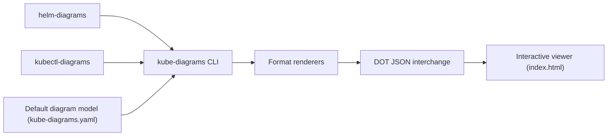

# philippemerle/KubeDiagrams

> Génère des schémas d'architecture Kubernetes à partir de manifestes, Helm, Kustomize ou de l'état d'un cluster.

## Le problème
Comprendre ou documenter une application Kubernetes en lisant des dizaines de fichiers YAML.

## Ce que ça fait vraiment
`kube-diagrams` lit du YAML Kubernetes normalisé (via kubectl, Kustomize, Helm, Helmfile en amont) et dessine des nœuds, des grappes par namespace ou label, et des liens typés. 51 types de ressources natifs, CRD via fichiers de configuration. Sorties D2, DOT, draw.io, Mermaid, PNG, SVG, PDF. Visionneuse interactive et application web incluses.

## Comment c'est branché


## Essayer
```bash
pip install KubeDiagrams
kube-diagrams -o cassandra.png examples/cassandra/cassandra.yml
kubectl get all -o yaml | kube-diagrams -o default-namespace.png -
helm-diagrams https://charts.jetstack.io/cert-manager -o diagram.png
```

## Coût et pièges
Gratuit ; nécessite Python 3.9+ et Graphviz (`dot`). `helm-diagrams` demande `helm`. Windows : seule l'image conteneur est prise en charge.

## Ce que ce n'est pas
Pas un outil de supervision : il dessine ce qu'on lui donne, il ne se connecte pas au cluster de lui-même. 12 ressources natives ne sont pas gérées.

## Alternatives
Le README renvoie à une comparaison d'outils, sans en nommer dans le texte.

## Pour toi
À adopter si tu déploies des workloads d'IA ou de données sur Kubernetes : sortie utilisable en documentation, installation simple, licence Apache-2.0.
