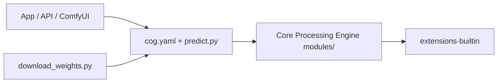

# philz1337x/clarity-upscaler

> Agrandisseur et amélioreur d'images par IA, version libre d'une offre payante, via Cog, ComfyUI ou A1111.

## Le problème
Agrandir des images en ajoutant des détails plausibles, sans passer par un service payant.

## Ce que ça fait vraiment
Le dépôt est une implémentation pour Cog, dérivée de la base A1111 (modules de traitement, extensions LDSR, Lora, ScuNET, SwinIR). Il propose aussi un workflow gratuit pour ComfyUI et des paramètres A1111. L'application ClarityAI.co, son API et le nœud ComfyUI sont payants. La version Flux n'est pas open source.

## Comment c'est branché


## Essayer
```bash
python download_weights.py
cog predict -i image="link-to-image"
```

## Coût et pièges
GPU pour exécuter en local. L'option simple est l'app payante. Licence AGPL-3.0. Dernier push en mars 2025.

## Ce que ce n'est pas
Ce n'est pas la version la plus récente de l'auteur : Flux upscaling est fermé. Le README recommande des options plus simples que Cog.

## Alternatives
- ComfyUI (workflow gratuit) et A1111 : recommandés par le README pour éviter Cog.

## Pour toi
À ignorer : outil de traitement d'image sans lien fort avec ton métier, financé par une offre payante, plus mis à jour depuis mars 2025.
