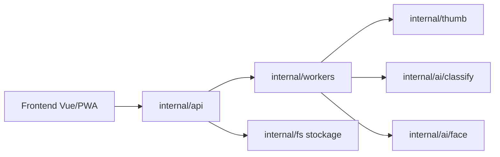

# photoprism/photoprism

> Application photo auto-hébergée avec étiquetage IA et reconnaissance de visages, pour particuliers.

## Le problème
Organiser une grosse photothèque sans la confier à Google, Apple ou Amazon.

## Ce que ça fait vraiment
Serveur Go + PWA Vue : indexation, miniatures et transcodage (workers), classification, détection de visages et filtre NSFW via TensorFlow (`internal/ai`), recherche multi-critères, cartes, extraction Exif/XMP, accès WebDAV. Bases MariaDB/MySQL/Postgres selon les compose fournis.

## Comment c'est branché

## Essayer
Aucune commande dans le README : l'installation Docker est renvoyée vers docs.photoprism.app.

## Coût et pièges
Édition communautaire gratuite ; adhésion ou licence commerciale encouragées, certaines fonctions potentiellement réservées (non détaillé). Licence non identifiée par GitHub, documentation en CC BY-NC-SA.

## Ce que ce n'est pas
Pas une bibliothèque de vision réutilisable. Les issues GitHub ne servent pas au support.

## Alternatives
Aucune nommée dans le README.

## Pour toi
Usage perso possible ; vérifie la licence avant tout usage pro.
