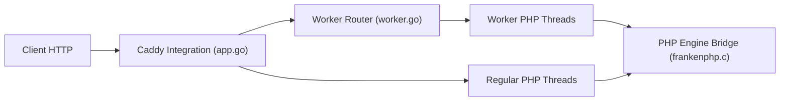

# php/frankenphp

> Serveur d'applications PHP construit sur Caddy, pour équipes déployant Laravel ou Symfony.

## Le problème
PHP-FPM derrière Nginx redémarre l'application à chaque requête et sépare serveur web et interpréteur.

## Ce que ça fait vraiment
Intègre PHP dans Caddy : HTTPS automatique, HTTP/2 et HTTP/3, mode worker (scripts PHP persistants), Early Hints, rechargement à chaud. Utilisable aussi comme bibliothèque Go pour embarquer PHP dans `net/http`. Existe en binaire, paquets rpm/deb/apk, Homebrew et Docker.

## Comment c'est branché


## Essayer
```bash
curl https://frankenphp.dev/install.sh | sh
frankenphp php-server
docker run -v .:/app/public -p 80:80 -p 443:443 -p 443:443/udp dunglas/frankenphp
```

## Coût et pièges
Gratuit. Sur `https://localhost`, accepter le certificat auto-signé ; `127.0.0.1` ne convient pas.

## Ce que ce n'est pas
Pas un framework PHP : il sert des applications existantes. Le mode worker suppose une application adaptée.

## Alternatives
Migration depuis Nginx/PHP-FPM documentée ; aucun autre dépôt nommé.

## Pour toi
Ignorer : serveur PHP, sans lien avec les workflows data/IA/MLOps.

