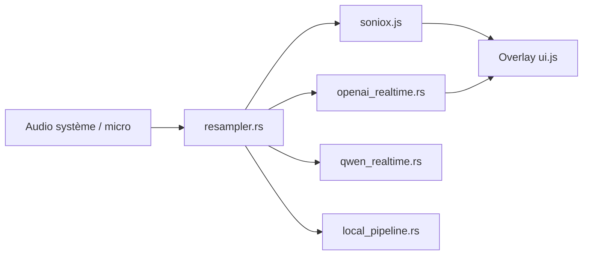

# phuc-nt/my-translator

> Application de bureau Tauri qui traduit en direct l'audio système ou micro, sans serveur intermédiaire.

## Le problème
Suivre une réunion ou une vidéo en langue étrangère exige des sous-titres en temps réel, pas un service qui passe par un relais tiers.

## Ce que ça fait vraiment
Capture l'audio système (ScreenCaptureKit, WASAPI) et le micro, rééchantillonne à 16 kHz et l'envoie au moteur choisi : Soniox, OpenAI Realtime, Qwen LiveTranslate ou un mode local MLX (Apple Silicon, expérimental). Affiche la traduction en surimpression, traduction bidirectionnelle, synthèse vocale optionnelle (Edge, Google, ElevenLabs), transcripts en `.md`.

## Comment c'est branché


## Essayer
```bash
git clone https://github.com/phuc-nt/my-translator.git
cd my-translator
npm install
npm run tauri build
```
Ou télécharger le .dmg / .exe depuis les releases.

## Coût et pièges
Clés à ta charge : ~0,12 $/h (Soniox), ~4 $/h (OpenAI), aperçu gratuit Qwen. Mode local : Apple Silicon seulement, latence ~10 s.

## Ce que ce n'est pas
Pas hors ligne par défaut : seul le mode MLX l'est. Pas de version Linux.

## Alternatives
Aucune alternative citée dans le README.

## Pour toi
À surveiller : bon exemple de pipeline de traduction temps réel avec plusieurs moteurs ; utile pour réunions, sans lien direct avec ton travail MLOps.

