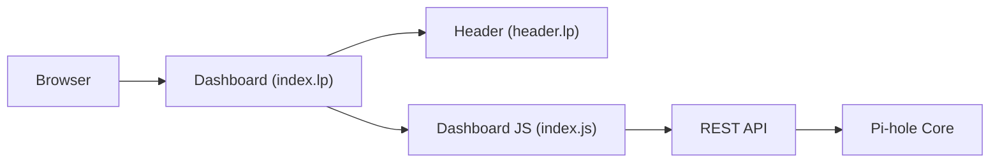

# pi-hole/web

> Interface web d'administration de Pi-hole, le bloqueur de pubs réseau, pour piloter le DNS.

## Le problème
Configurer un DNS bloquant et lire ses statistiques sans passer par la ligne de commande.

## Ce que ça fait vraiment
Pages Lua (`.lp`) rendues côté serveur avec JavaScript par page : tableau de bord, journal des requêtes, journaux en direct, groupes et listes allow/block, réglages DNS/DHCP/confidentialité, Teleporter (export/import), recherche de domaines. S'appuie sur l'API REST `/api` de Pi-hole (documentation en `/api/docs`). Thèmes multiples, base AdminLTE.

## Comment c'est branché

## Essayer
Le README ne donne pas de commande ; l'interface est activée à l'installation de Pi-hole et accessible sur `https://pi.hole/admin/`.

## Coût et pièges
Gratuit. Nécessite une installation Pi-hole. Licence non identifiée par GitHub : à vérifier.

## Ce que ce n'est pas
Ce n'est pas un projet autonome : sans Pi-hole et FTLDNS il ne sert à rien.

## Alternatives
Aucune alternative nommée dans le README.

## Pour toi
À ignorer pour la veille data/IA : brique d'un outil réseau domestique, utile seulement si tu administres déjà un Pi-hole.
