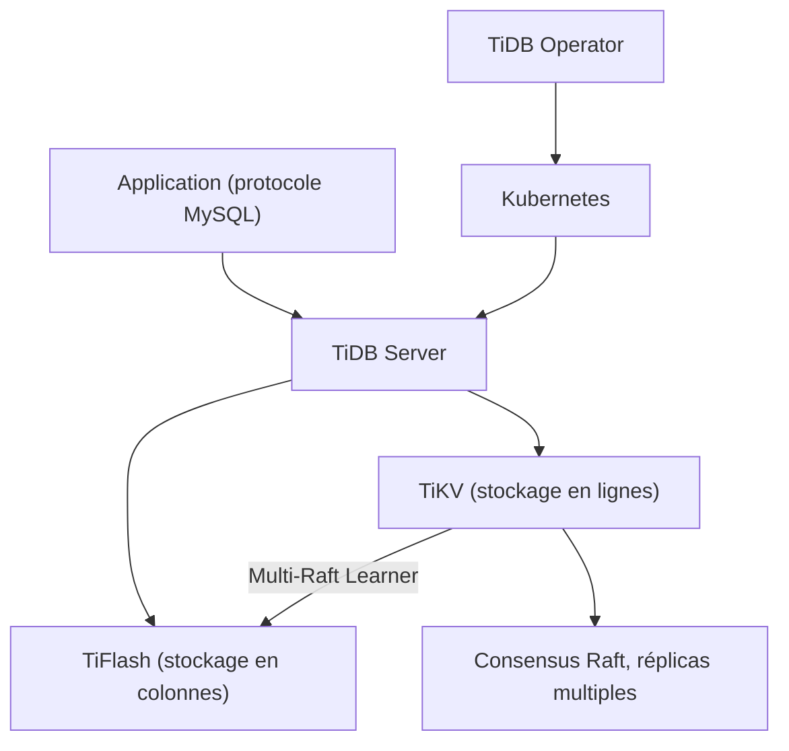

# pingcap/tidb

> Base SQL distribuée compatible MySQL 8.0, transactionnelle et analytique à la fois.

## Le problème
Passé une certaine taille, MySQL impose du sharding applicatif, et l'analytique demande une
seconde base alimentée par ETL, avec la dérive de données qui va avec.

## Ce que ça fait vraiment
Assure des transactions distribuées ACID par validation en deux phases, y compris en cas de
partition réseau ou de panne de nœud.
Sépare calcul et stockage, ce qui permet d'ajouter des nœuds sans interruption, horizontalement
ou verticalement. La réplication s'appuie sur Raft : une transaction n'est validée qu'après
écriture sur la majorité des réplicas, et le placement géographique des réplicas est configurable.
Fournit deux moteurs : TiKV en lignes et TiFlash en colonnes, TiFlash répliquant TiKV en temps réel
via Multi-Raft Learner ; le serveur TiDB coordonne les requêtes sur les deux (HTAP).

## Comment c'est branché


## Essayer
```bash
# Aucune commande dans le README : il renvoie au guide de démarrage rapide,
# à TiDB Operator pour Kubernetes, ou à l'inscription TiDB Cloud.
```

## Coût et pièges
Le code est sous Apache 2.0, fonctionnalités d'entreprise comprises. TiDB Cloud, le service géré
de PingCAP, est la voie « recommandée » par le README, avec une offre gratuite. En auto-hébergé,
une grappe TiDB + TiKV + TiFlash + PD demande des machines et de l'exploitation.

## Ce que ce n'est pas
Ce n'est pas un MySQL de remplacement transparent pour tous les cas : le README parle de migration
« sans changement de code ou avec des modifications minimes ». Ce n'est pas une base analytique
pure : TiFlash complète TiKV, il ne le remplace pas.

## Alternatives
Aucune alternative nommée dans le README.

## Pour toi
Pertinent si tes tableaux de bord et ton applicatif se disputent la même base de production.
