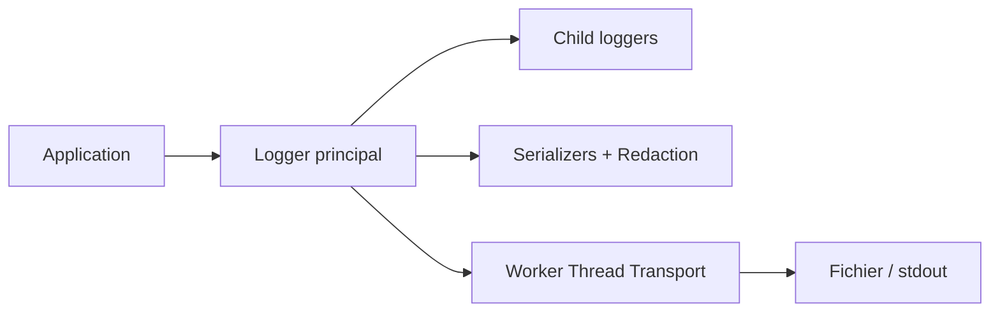

# pinojs/pino

> Journaliseur JavaScript à très faible surcoût, sorties en JSON, pour applications Node.js.

## Le problème
Un logger lent ou synchrone réduit le nombre de requêtes par seconde d'un service.

## Ce que ça fait vraiment
Produit des lignes JSON (niveau, horodatage, message, pid, hostname), avec loggers enfants qui héritent de propriétés, masquage de champs (redaction) et sérialiseurs. Le traitement lourd (envoi, alertes, formatage) est déporté dans des « transports » exécutés dans un worker thread via `pino.transport`. `pino-pretty` sert au développement. Il fonctionne aussi sous Bare et Pear via `pino-bare`.

## Comment c'est branché


## Essayer
```bash
npm install pino
```
```js
const logger = require('pino')()
logger.info('hello world')
const child = logger.child({ a: 'property' })
```

## Coût et pièges
Gratuit. Le README recommande de ne pas faire de traitement de logs dans le thread principal.

## Ce que ce n'est pas
Ce n'est pas une plateforme d'observabilité : il émet des logs, il ne les stocke ni ne les analyse.

## Alternatives
Le README dit « plus de 5 fois plus rapide que les alternatives » sans en nommer.

## Pour toi
À ignorer pour un profil data/IA en Python ; utile seulement si tu écris des services Node.js.

