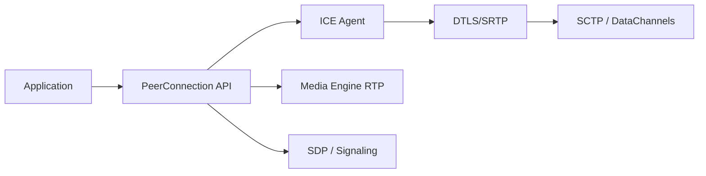

# pion/webrtc

> Implémentation WebRTC en pur Go, sans Cgo, pour développeurs de flux audio, vidéo et données temps réel.

## Le problème
WebRTC est dominé par des piles C++ difficiles à embarquer dans un serveur ou un appareil Go.

## Ce que ce n'est pas... (voir plus bas)
Le README présente l'API PeerConnection (canaux de données, audio/vidéo, renégociation), un agent ICE complet (STUN, TURN, ICE restart, trickle), DTLS/SRTP, packetizers Opus/H264/VP8/VP9, simulcast, SVC, NACK et estimation de bande passante. Pur Go, multiplateforme (dont WASM), sans Cgo (sauf `getUserMedia`).

## Ce que ça fait vraiment
Une bibliothèque où l'application pilote une PeerConnection ; en dessous, ICE, DTLS, SCTP (canaux de données), un moteur média RTP/RTCP, SDP/signalisation et des interceptors, réglables via `SettingEngine`. Exemples fournis dans des dépôts voisins.

## Comment c'est branché


## Essayer
```bash
export GO111MODULE=on
```
Import avec `/v4` explicite. Aucune autre commande dans le README (exemples dans un dépôt séparé).

## Coût et pièges
Gratuit. Modules Go obligatoires. Une v4 est sortie : les projets en v3 doivent migrer. Pas de serveur de signalisation fourni.

## Ce que ce n'est pas
Ce n'est pas un serveur de visioconférence prêt à l'emploi : c'est une brique. Ce n'est pas un client navigateur.

## Alternatives
Aucune alternative nommée dans le README.

## Pour toi
À surveiller : brique solide si tu streames des données ou des flux vers des modèles depuis Go ; hors Go, sans intérêt direct.

