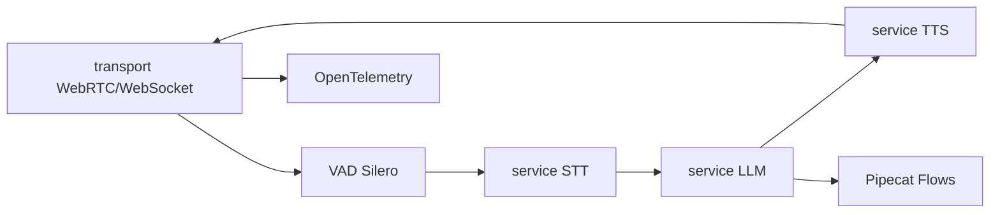

# pipecat-ai/pipecat

> Framework Python pour agents vocaux et multimodaux temps réel.

## Le problème
Une conversation vocale naturelle demande d'enchaîner VAD, transcription, LLM,
synthèse et transport WebRTC avec une latence tenue — chaque brique ayant son API.

## Ce que ça fait vraiment
Assemble des pipelines composables où chaque pipeline est un agent : on compose par
handoff, fan-out parallèle, workers side-car sur un bus partagé, en local ou
distribué entre processus et machines. Catalogue d'intégrations très large :
speech-to-text (AssemblyAI, Deepgram, Whisper, Gladia, Speechmatics…), LLM
(Anthropic, Gemini, OpenAI, Mistral, Ollama, Groq…), text-to-speech (Cartesia,
ElevenLabs, Piper, Kokoro…), speech-to-speech (OpenAI Realtime, Gemini Multimodal
Live, AWS Nova Sonic), transports (Daily, LiveKit, SmallWebRTC, WebSocket, WhatsApp),
sérialiseurs télécom (Twilio, Telnyx, Plivo, Genesys), vidéo (HeyGen, Tavus),
mémoire (mem0), traitement audio (Silero VAD, Krisp, RNNoise), métriques
OpenTelemetry et Sentry. Pipecat Flows gère les conversations structurées.

## Comment c'est branché


## Essayer
```bash
uv tool install "pipecat-ai[cli]"
pipecat init quickstart
claude plugin marketplace add pipecat-ai/skills
```

## Coût et pièges
Le framework est gratuit, la facture vient des fournisseurs : STT, LLM et TTS sont
facturés à la minute ou au token, et un agent vocal consomme en continu. Un
transport WebRTC managé (Daily, LiveKit) ajoute son propre coût. Le CLI sert aussi
à déployer sur Pipecat Cloud — offre commerciale du même éditeur.

## Ce que ce n'est pas
Pas un agent vocal clé en main : une charpente à câbler, et le choix des services
reste entier. Le README est tronqué avant la fin. Les outils compagnons (Whisker,
Tail, Pipecat UI) sont des dépôts séparés.

## Alternatives
- Pipecat Flows : intégré, pour les parcours conversationnels prédéfinis.
- Aucune alternative externe nommée dans le README.

## Pour toi
La référence côté Python pour un agent vocal ; à surveiller si un projet client
demande de la voix temps réel.
