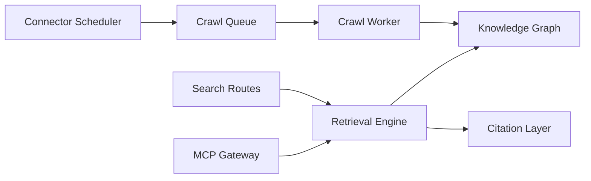

# pipeshub-ai/pipeshub-ai

> Plateforme auto-hébergée de recherche d'entreprise avec citations, respectant les droits d'accès des sources.

## Le problème
Les réponses d'un LLM sur les documents internes (Slack, Drive, GitHub, Microsoft 365, Notion) doivent respecter qui a le droit de voir quoi.

## Ce que ça fait vraiment
Des connecteurs (50+ selon le README) synchronisent les sources ; les documents sont analysés puis stockés dans un graphe de connaissances (Neo4j ou ArangoDB), Qdrant et MongoDB. À la requête, le filtrage se fait sur les permissions de la source, un LLM répond avec des citations au niveau du bloc. La pile : application Next.js, API Node.js, services Python ; un serveur MCP, des SDK (Python, TypeScript, Go) et un constructeur d'agents sans code sont proposés.

## Comment c'est branché


## Essayer
```bash
curl -fsSL https://get.pipeshub.com/install | bash
git clone https://github.com/pipeshub-ai/pipeshub-ai.git
cd pipeshub-ai
./install.sh
```

## Coût et pièges
Docker Compose v2 ; l'installeur vérifie RAM et disque. Il faut un LLM et un modèle d'embedding (fournisseur au choix ou Ollama). Les déploiements cloud exigent HTTPS. Le README conseille de lire le script avant de l'exécuter.

## Ce que ce n'est pas
Pas un service géré : l'offre cloud est « bientôt disponible ». L'audio et la vidéo sont stockés mais pas indexés. Plusieurs liens internes de l'architecture sont déduits, pas vérifiés dans le code.

## Alternatives
Aucune alternative n'est citée dans le README.

## Pour toi
À surveiller : pertinent si tu dois faire du RAG d'entreprise avec permissions, mais pile lourde (graphe, vecteurs, MongoDB, Redis) et 158 issues ouvertes.
