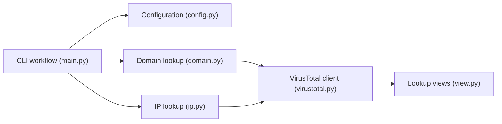

# pirxthepilot/wtfis

> Outil en ligne de commande qui agrège des services OSINT pour renseigner un domaine, un nom d'hôte ou une IP.

## Le problème
Les consultations de réputation d'IP ou de domaine sont dispersées entre services aux interfaces peu lisibles et aux quotas serrés.

## Ce que ça fait vraiment
- Interroge VirusTotal (source principale), plus AbuseIPDB, Greynoise, IP2Location, IP2Whois, IPinfo, IPWhois, Shodan, URLhaus.
- Affiche des panneaux lisibles dans le terminal ; accepte les entrées « défangées ».
- Limite les appels pour rester dans les quotas gratuits ; chaque service est optionnel.

## Comment c'est branché


## Essayer
```bash
pip install wtfis
export VT_API_KEY=...
wtfis FQDN_OR_DOMAIN_OR_IP
wtfis -A example.com
```

## Coût et pièges
Gratuit avec des comptes communautaires ; clés par service, quotas faibles (Greynoise : 50 requêtes par semaine en 2023). Fichier `~/.env.wtfis` à protéger par `chmod 400`.

## Ce que ce n'est pas
Pas un scanner actif : requêtes passives uniquement, sur des bases tierces.

## Alternatives
Aucune alternative nommée dans le README.

## Pour toi
À surveiller : utile si tu fais de la réponse à incident ou de l'enrichissement d'IoC, marginal pour un profil data/IA.

