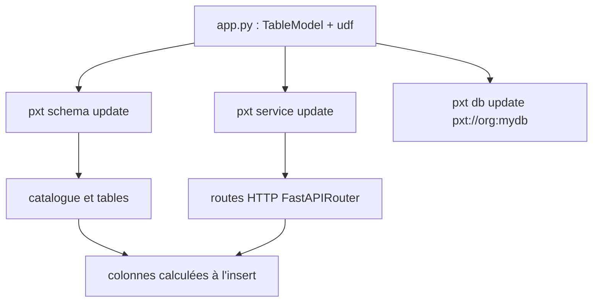

# pixeltable/pixeltable

> Base de données multimodale où transformations, index et routes HTTP se déclarent dans un seul fichier Python.

## Le problème
Une application multimodale se répartit d'ordinaire sur quatre systèmes : stockage objet, base vectorielle, orchestrateur, code d'endpoint.
Le code qui recopie les données entre eux est à écrire, à maintenir, et à relire dans quatre diffs séparés.

## Ce que ça fait vraiment
Les images, vidéos, audios et documents vivent dans des tables ; une transformation est une colonne calculée, un index une déclaration.
Insérer une ligne déclenche tout ce qui est en dessous. Une route HTTP se déclare avec `FastAPIRouter` dans le même fichier.
`pxt schema update` crée le catalogue et les tables sans démarrer HTTP ; `pxt service update` démarre HTTP sans créer de tables.
Le même `app.py` tourne en local ou sur Pixeltable Cloud, ciblé par URI `pxt://org:mydb`.

## Comment c'est branché


## Essayer
```bash
pip install 'pixeltable[serve]'
pxt init
pxt service example --out app.py
pxt schema update app.py my_app
pxt service update app.py my_app
```

## Coût et pièges
Le port est attribué dynamiquement : le relire via `pxt service list --json` plutôt que de le coder en dur.
La route `/ask` de l'app de démo exige `ANTHROPIC_API_KEY` ; Pixeltable Cloud est en bêta limitée sur demande par e-mail.

## Ce que ce n'est pas
Pas un simple ORM : le moteur exécute des transformations à l'insertion, ce qui déplace le coût de calcul dans la base.
Pas un produit figé : le README signale que le skill agent installé peut être périmé (`pxt serve` supprimé, `create_table` déplacé).
Notebooks et tests continuent d'utiliser `pxt.create_table()`, l'application non — deux conventions cohabitent.

## Alternatives
Aucune alternative nommée dans le README.

## Pour toi
Le cas d'usage RAG / pipeline média en un fichier vaut un essai local ; le Cloud, non, tant qu'il est en bêta fermée.
