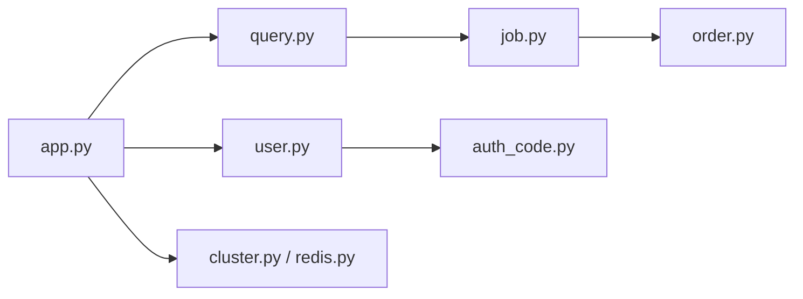

# pjialin/py12306

> Assistant Python qui guette et réserve des billets de train sur le site chinois 12306.

## Le problème
Les billets de train chinois partent vite ; surveiller les disponibilités sur plusieurs dates et comptes à la main est fastidieux.

## Ce que ça fait vraiment
Interroge les places par dates, routes et stations, maintient les sessions de comptes, résout le captcha (seul le mode `free` reste, la solution payante « ruoshi » est arrêtée), passe la commande, et notifie (mail, voix, Telegram, DingTalk, ServerChan). Mode distribué via Redis, interface web optionnelle.

## Comment c'est branché


## Essayer
```bash
git clone https://github.com/pjialin/py12306
pip install -r requirements.txt
cp env.py.example env.py
python main.py -t
python main.py
```

## Coût et pièges
Compte 12306 requis. Les notifications vocales passent par un service Aliyun payant. README en chinois, Python 3.6+ « autres versions non testées ». Risque de blocage d'IP depuis un cloud.

## Ce que ce n'est pas
Pas un produit générique. Dépend de l'API non officielle de 12306 et d'un service de captcha tiers : peut casser sans prévenir.

## Alternatives
Aucune alternative nommée dans le README.

## Pour toi
À ignorer : sans rapport avec un profil data/IA/MLOps, et fragile car greffé sur un site tiers.

