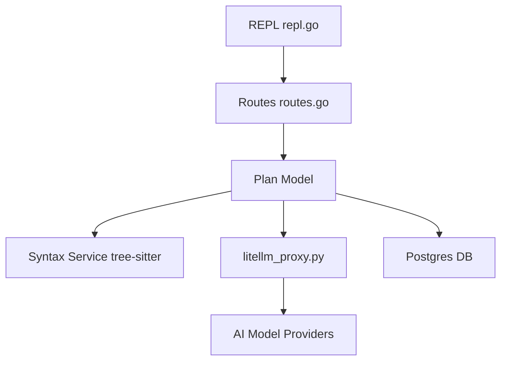

# plandex-ai/plandex

> Agent de code en terminal pour les grosses tâches sur plusieurs fichiers, avec un bac à sable de diffs.

## Le problème
Les assistants de code s'essoufflent sur les gros projets et laissent des modifications éparpillées, difficiles à relire et à annuler.

## Ce que ça fait vraiment
Il planifie puis exécute des tâches sur des dizaines de fichiers, avec jusqu'à 2M tokens de contexte et des cartes de projet tree-sitter.
Les modifications restent dans un bac à sable de diffs cumulés jusqu'à validation. Chaque plan est versionné, avec des branches.
Il débogue automatiquement les commandes, s'intègre à Git et combine plusieurs fournisseurs de modèles.
L'architecture sépare une CLI Go et un serveur avec Postgres.

## Comment c'est branché


## Essayer
```bash
curl -sL https://plandex.ai/install.sh | bash
export OPENROUTER_API_KEY=...
plandex
pdx
```

## Coût et pièges
Les clés sont à ta charge (OpenRouter, ou un abonnement Claude Pro/Max). Plandex Cloud ferme depuis le 2025-10-03 : il ne reste que l'auto-hébergement via Docker.

## Ce que ce n'est pas
Il ne tourne pas sous Windows hors WSL. Aucun push depuis le 2025-10-03, ce qui fait douter de sa pérennité.

## Alternatives
Le README ne nomme aucun dépôt alternatif.

## Pour toi
À surveiller : les idées de bac à sable de diffs et de plans versionnés sont bonnes, mais l'arrêt du cloud et le silence du dépôt font craindre un projet en sommeil.
