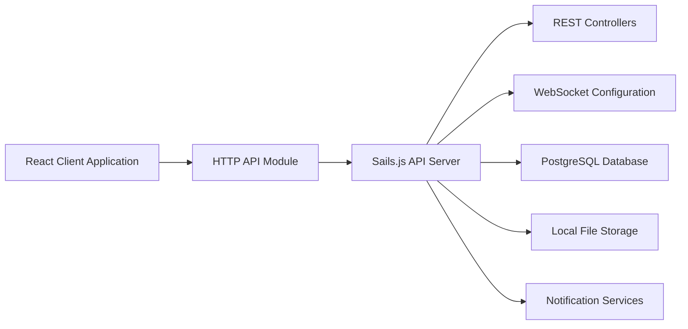

# plankanban/planka

> Tableau kanban collaboratif temps réel auto-hébergé, alternative ouverte à Trello pour équipes.

## Le problème
Les outils kanban SaaS gardent tes données chez eux ; il faut une option auto-hébergée avec temps réel et API.

## Ce que ça fait vraiment
Projets, tableaux, listes, cartes, markdown, pièces jointes, commentaires, champs personnalisés, chronomètre.
Synchronisation temps réel par WebSocket, notifications via 100+ fournisseurs, webhooks, API REST, 2FA.
Client React/Redux, serveur Sails.js, PostgreSQL, stockage local ou S3.
Version Pro payante (SSO, vues calendrier/timeline, templates), migration à sens unique.

## Comment c'est branché

## Essayer
Aucune commande dans le README : il renvoie au guide d'installation externe.

## Coût et pièges
Community gratuite en auto-hébergement ; Pro payante, passage Pro irréversible (sauvegarde obligatoire).
Licence présente mais non identifiée par GitHub : à lire avant usage.

## Ce que ce n'est pas
Pas un outil de gestion de projet complet côté Community : SSO, templates, cartes multi-tableaux sont réservés au Pro.
Pas de support public par e-mail.

## Alternatives
Aucune alternative nommée dans le README.

## Pour toi
À ignorer pour un profil data/IA : c'est un outil d'équipe générique, et la licence non identifiée demande vérification avant tout déploiement.
