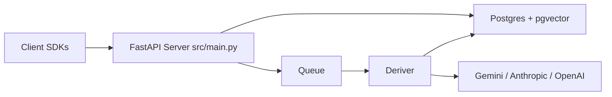

# plastic-labs/honcho

> Infrastructure de mémoire pour agents : stocke les échanges et raisonne sur les pairs en arrière-plan.

## Le problème
Les agents oublient tout entre les sessions, et une simple recherche vectorielle ne construit pas une compréhension de l'utilisateur.

## Ce que ça fait vraiment
Un modèle workspace → peers → sessions → messages ; un worker « deriver » tire des conclusions et des représentations de manière asynchrone.
API : `peer.chat`, `session.context(...).to_openai()`, recherche hybride BM25 + vecteur, représentations à faible latence.
Serveur FastAPI, Postgres + pgvector, SDK Python et TypeScript, CLI.
Plugins pour Claude Code, Codex, Cursor, OpenCode, et MCP.

## Comment c'est branché


## Essayer
```bash
pip install honcho-ai
uv tool install honcho-cli
honcho start --setup basic
```

## Coût et pièges
L'auto-hébergement exige trois clés LLM (Gemini, Anthropic, OpenAI). Le service managé est payant (100 $ de crédit offerts).

## Ce que ce n'est pas
Pas instantané : le raisonnement est asynchrone, et les nouveaux messages mettent du temps à apparaître.

## Alternatives
Aucune alternative nommée dans le README.

## Pour toi
À surveiller : l'approche mémoire par raisonnement, pour agents et coding agents, est pertinente, mais l'AGPL et la dépendance à plusieurs LLM pèsent.
