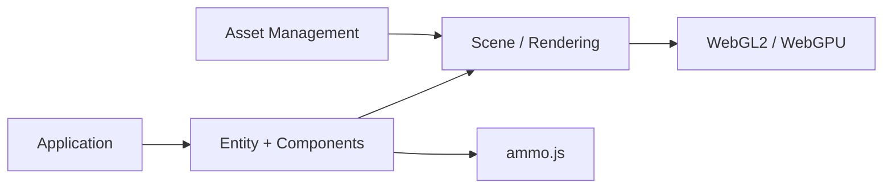

# playcanvas/engine

> Moteur de jeu open source WebGL2/WebGPU pour applications 3D dans le navigateur, côté développeurs web.

## Le problème
Faire de la 3D interactive dans un navigateur demande de réassembler rendu, physique, son et assets.

## Ce que ça fait vraiment
Un moteur à entités et composants : graphisme 2D/3D en WebGL2 et WebGPU, Gaussian Splatting, WebXR, physique via ammo.js, animation, entrées, son 3D, chargement d'assets glTF/Draco/Basis, scripts TypeScript ou JavaScript. Écosystème : `@playcanvas/react`, `@playcanvas/web-components`, `create-playcanvas` et un éditeur en ligne.

## Comment c'est branché


## Essayer
```bash
npm install playcanvas
npm create playcanvas@latest
npm install
npm run build
```

## Coût et pièges
Gratuit, Node.js 18+ pour compiler. 491 issues ouvertes. L'éditeur visuel est un produit séparé.

## Ce que ce n'est pas
Ce n'est pas l'éditeur PlayCanvas : le dépôt ne contient que le moteur. Ce n'est pas un outil de data-viz clé en main.

## Alternatives
Aucune alternative nommée dans le README.

## Pour toi
À surveiller : très actif et solide, mais ton métier data/IA ne le sollicite que pour de la visualisation 3D ou du Gaussian Splatting dans le navigateur.

