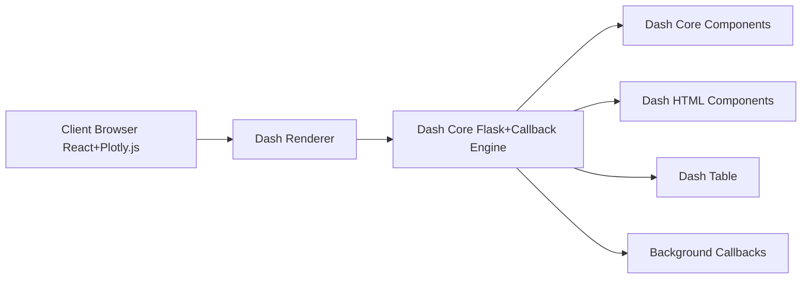

# plotly/dash

> Framework Python pour construire des applications web analytiques interactives sans écrire de JavaScript.

## Le problème
Exposer une analyse ou un modèle dans une interface interactive oblige d'ordinaire à écrire un front React et une API.

## Ce que ça fait vraiment
Déclare la mise en page en Python (composants core, HTML, table) rendue par React et Plotly.js.
Callbacks réactifs Python reliant entrées et sorties, servis par Flask.
Callbacks en arrière-plan via Celery ou DiskCache pour les calculs longs.
~50 types de graphiques ; Dash Enterprise (payant) ajoute déploiement, auth, job queue.

## Comment c'est branché

## Essayer
Aucune commande d'installation documentée dans le README (renvoi au tutoriel).

## Coût et pièges
Gratuit en open source (MIT). Partage, auth et scalabilité relèvent de Dash Enterprise, payant.

## Ce que ce n'est pas
Pas une solution d'hébergement : l'OSS tourne en local. README largement promotionnel pour l'offre Enterprise.

## Alternatives
Aucune alternative nommée dans le README.

## Pour toi
Adopter : outil sûr pour transformer un notebook en tableau de bord interactif Python, à condition de gérer toi-même déploiement et authentification.
