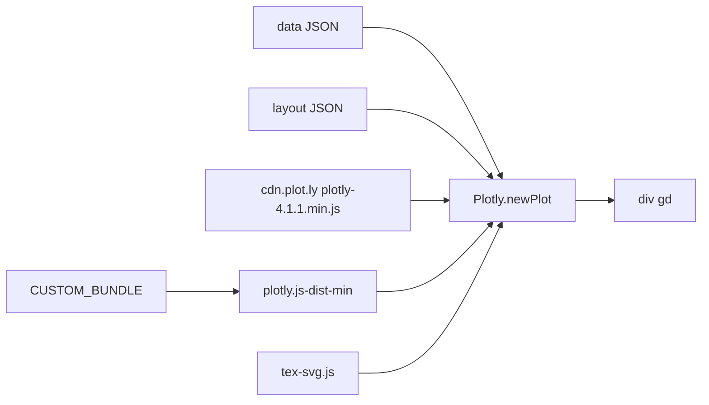

# plotly/plotly.js

> Bibliothèque JavaScript de visualisation interactive, moteur des paquets `plotly` Python et R.

## Le problème
Un graphique interactif dans un navigateur demande soit beaucoup de D3 à la main, soit un composant fermé.
Et passer du prototype Python au rendu web casse souvent le graphique en chemin.

## Ce que ça fait vraiment
Des dizaines de types de graphiques : statistiques, 3D, scientifiques, cartes SVG et tuiles, finance.
Un graphique se décrit en JSON (`data`, `layout`) et s'affiche avec `Plotly.newPlot("gd", ...)`.
Rend les formules mathématiques entre `$..$` si MathJax v3 ou v4 est chargé séparément sur la page.
Deux familles de bundles : officiels complets ou partiels sur npm et CDN, ou bundles sur mesure.

## Comment c'est branché


## Essayer
```bash
npm i --save plotly.js-dist-min
```
Ou par balise script : `<script src="https://cdn.plot.ly/plotly-4.1.1.min.js" charset="utf-8"></script>`,
puis `Plotly.newPlot("gd", [{ y: [1, 2, 3] }])`.

## Coût et pièges
Depuis la v2, `plotly-latest.min.js` n'est plus mis à jour et reste figé en v1.58.5 : il faut épingler
une version exacte sur le CDN. Plusieurs graphiques WebGL sur une page demandent le script `virtual-webgl`.

## Ce que ce n'est pas
Pas un paquet léger par défaut : le bundle complet est lourd, d'où les bundles partiels et sur mesure.
Pas la documentation : elle vit dans un autre dépôt, `graphing-library-docs`.
Pas indépendant de MathJax pour les formules : MathJax n'est pas inclus.

## Alternatives
`plotly.js-dist` — la même chose non minifiée, si tu préfères lire le code livré.

## Pour toi
Le socle derrière Plotly.py : connaître les bundles t'évite de livrer 3 Mo de JS pour un histogramme.
