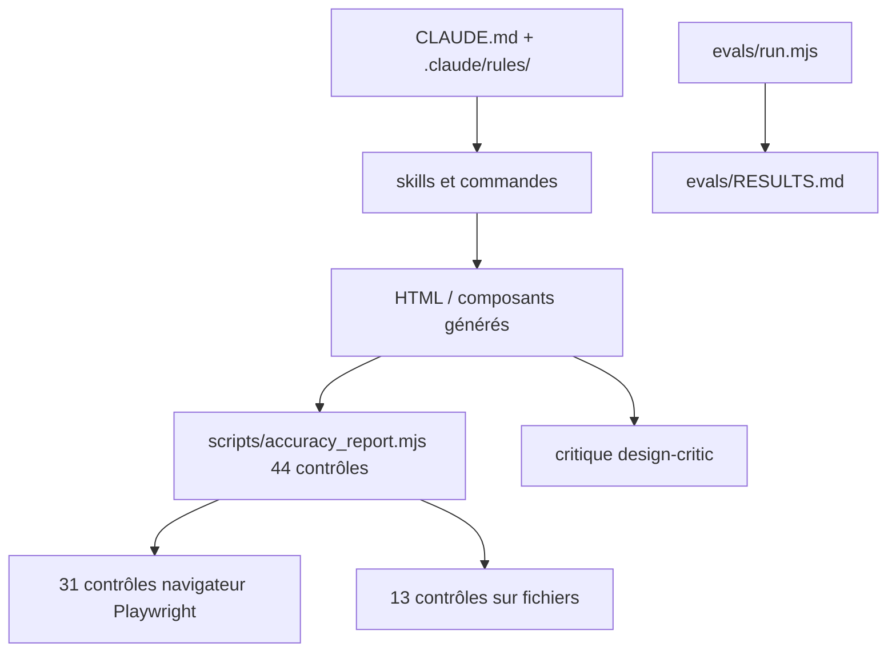

# plugin87/ux-ui-agent-skills

> Couche d'instructions et de contrôles automatiques qui encadre la production d'interfaces par un agent.

## Le problème
Un agent laissé libre produit toujours la même interface : dégradé indigo-violet, quatre cartes identiques, emoji en guise d'icônes, texte gris peu contrasté.
Rien ne distingue objectivement ce résultat d'un travail correct, donc rien ne le bloque.

## Ce que ça fait vraiment
Fournit 19 skills invocables, 5 commandes (`/gate`, `/critique`, `/grill-me`, `/ship`, `/scaffold-project`) et un agent `design-critic`, sans build ni dépendance d'exécution.
Génère des tokens au format DTCG sur trois niveaux (primitif → sémantique → composant) et cible n'importe quel framework via un protocole d'adaptateur.
Exécute 44 contrôles : 31 ouvrent un vrai navigateur et mesurent le HTML rendu (contraste WCAG clair et sombre, états par défaut/survol/focus, axe-core, pièges de focus, RTL, taille de cible, mouvement réduit), 13 lisent les fichiers.
`/critique` rend la page, clique les contrôles et argumente pour le rejet : il juge, il ne note pas.

## Comment c'est branché


## Essayer
```bash
npx ux-ui-agent-skills demo
npx ux-ui-agent-skills init
npm install
npx playwright install chrome
node scripts/accuracy_report.mjs
```

## Coût et pièges
Sans navigateur installé, 31 contrôles sur 44 remontent `REQUIRED, FAILING` ; lancés seuls ils affichent `SKIPPED` et sortent en code 0, d'où `DS_REQUIRE_BROWSER=1` si tu lis le code de sortie.
Playwright n'est installé ni par `/plugin install` ni par `npx … init`.

## Ce que ce n'est pas
Un score de 44/44 mesure la correction, pas la qualité : le README le dit et deux pages passant les 14 contrôles d'eval ont été renvoyées en « rework » par le critique.
Les composants framework (`.tsx`, `.vue`, `.swift`) ne sont atteints que par les contrôles qui lisent des fichiers, jamais par un rendu — limite nommée, pas escamotée.
`lint_intent_source` prouve une déclaration d'intention, jamais une couleur.

## Alternatives
Aucune alternative nommée dans le README.

## Pour toi
Si tu fais produire des interfaces à un agent, c'est le seul garde-fou mesurable du lot ; la licence non déclarée reste à lever avant usage professionnel.
