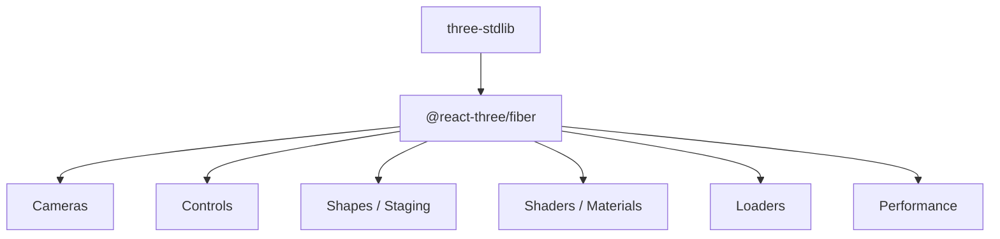

# pmndrs/drei

> Collection d'aides et d'abstractions prêtes à l'emploi pour @react-three/fiber, pour développeurs React faisant de la 3D web.

## Le problème
Écrire de la 3D avec three.js dans React demande beaucoup de code répétitif : caméras, contrôles, chargeurs, ombres, matériaux.

## Ce que ça fait vraiment
Fournit des composants et hooks regroupés en familles : caméras, contrôles, gizmos, formes, abstractions (Text, Html, Image…), shaders, chargeurs (useGLTF, useTexture…), performance (Instances, Bvh, AdaptiveDpr), portails et mise en scène (Environment, Stage, ContactShadows). Une version `native` existe pour React Native, sans `Html` ni `Loader`. La documentation détaillée est hébergée à part.

## Comment c'est branché


## Essayer
```bash
npm install @react-three/drei
yarn install
yarn build
yarn test
```

## Coût et pièges
Gratuit. Les tests visuels dépendent de Playwright et d'instantanés propres au système : le README conseille Docker pour reproduire la CI. Le paquet utilise `three-stdlib` plutôt que `three/examples/jsm`.

## Ce que ce n'est pas
Ce n'est pas un moteur 3D autonome : il suppose React, three.js et @react-three/fiber. Le README lui-même n'est plus qu'un index renvoyant à un site de documentation.

## Alternatives
Aucune alternative nommée dans le README.

## Pour toi
À surveiller : utile seulement si tu construis des visualisations 3D interactives (démos de modèles, jumeaux numériques) en React ; sans ce besoin, il n'apporte rien à un flux data/IA.

