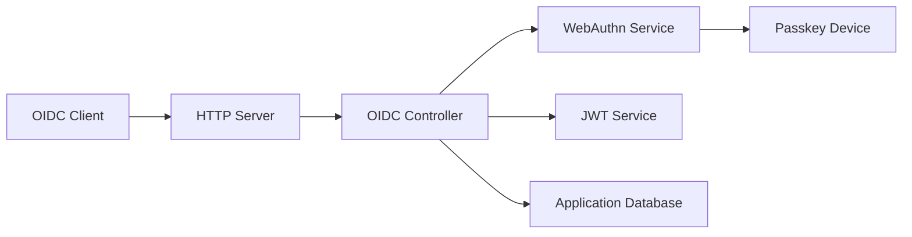

# pocket-id/pocket-id

> Fournisseur OpenID Connect et OAuth 2.0 auto-hébergé qui n'accepte que les passkeys, pour homelabs et petites équipes.

## Le problème
Keycloak ou ORY Hydra sont souvent trop lourds pour protéger quelques services auto-hébergés, et les mots de passe sont un maillon faible.

## Ce que ça fait vraiment
Un client OIDC redirige l'utilisateur vers Pocket ID, qui l'authentifie par passkey (WebAuthn, par exemple une YubiKey) puis émet des jetons. Interface d'administration pour utilisateurs et clients, clés d'API, journaux d'audit, vérification d'e-mail, synchronisation LDAP et SCIM, stockage en base et fichiers configurables. Certifié OpenID Connect selon le README.

## Comment c'est branché

## Essayer
Le README ne contient pas de commande : il renvoie à la documentation pour l'installation, Docker étant la voie recommandée. Aucune commande reprise.

## Coût et pièges
Gratuit. Tout le monde doit posséder un authentificateur compatible passkey ; pas de repli par mot de passe. Un seul mainteneur apparent.

## Ce que ce n'est pas
Pas un annuaire d'entreprise complet : plus simple que Keycloak, avec moins de fonctions.

## Alternatives
Keycloak et ORY Hydra, jugés trop complexes pour les cas simples.

## Pour toi
À adopter pour sécuriser tes outils MLOps auto-hébergés (MLflow, Grafana, notebooks) derrière un SSO simple ; licence BSD-2, activité récente.

