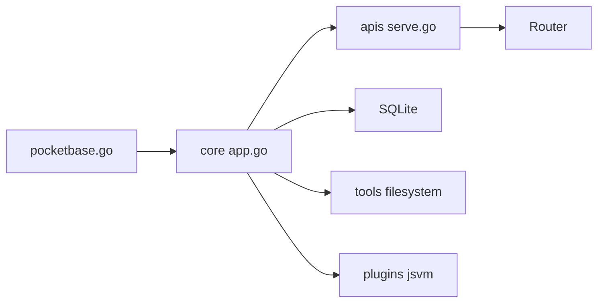

# pocketbase/pocketbase

> Backend Go en un seul binaire : base SQLite, API, authentification, fichiers et interface d'administration.

## Le problème
Monter un petit backend (base, comptes, stockage, temps réel) pour un prototype demande de multiples services à assembler.

## Ce que ça fait vraiment
PocketBase embarque SQLite, une API REST, des abonnements temps réel, la gestion d'utilisateurs (mot de passe, OTP, OAuth2, MFA), des fichiers locaux ou compatibles S3, des sauvegardes, des e-mails SMTP et un tableau de bord. Il se lance seul ou comme bibliothèque Go ; on l'étend en JavaScript (VM intégrée) ou en Go.

## Comment c'est branché


## Essayer
```bash
./pocketbase serve
cd examples/base
CGO_ENABLED=0 go build
./base serve
```

## Coût et pièges
Gratuit. Le README avertit : développement actif, compatibilité non garantie avant la v1.0.0. Compiler demande Go 1.27+.

## Ce que ce n'est pas
Ce n'est pas un moteur de base de données analytique : SQLite embarqué, sans broker externe pour le temps réel.

## Alternatives
Aucune alternative nommée dans le README.

## Pour toi
Surveiller : pratique pour un back léger d'application d'IA, mais pré-v1 et hors de ton cœur.

