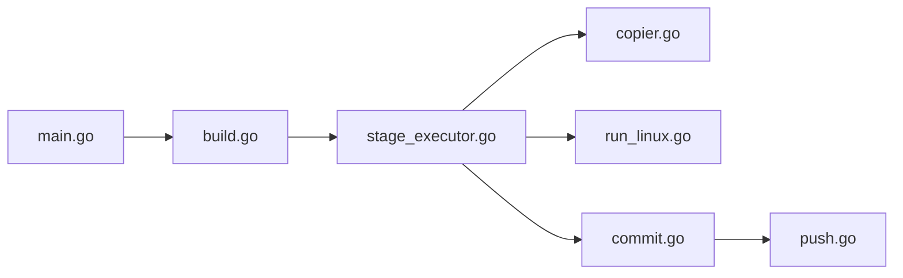

# podman-container-tools/buildah

> Outil en ligne de commande pour construire des images OCI sans démon, avec ou sans Dockerfile.

## Le problème
Construire des images conteneur sans démon Docker ni droits root, et pouvoir scripter la construction.

## Ce que ça fait vraiment
Crée un conteneur de travail depuis une image ou `scratch`, monte son système de fichiers, ajoute du contenu, configure, puis valide en image (`commit`). `buildah build` lit un Containerfile ou Dockerfile. Fork-exec, sans démon, avec une API Go réutilisable (Podman s'en sert).

## Comment c'est branché


## Essayer
```bash
ctr1=$(buildah from "${1:-fedora}")
buildah config --port 80 "$ctr1"
buildah commit "$ctr1" "${2:-$USER/lighttpd}"
```

## Coût et pièges
Gratuit. Les conteneurs Buildah ne sont pas visibles depuis Podman et inversement (stockages différents).

## Ce que ce n'est pas
Pas un moteur d'exécution de conteneurs : pour les gérer, le README renvoie à Podman.

## Alternatives
- Podman : complémentaire, il gère et lance les conteneurs.

## Pour toi
À surveiller : pratique pour construire des images ML en CI sans démon, si tu n'es pas déjà satisfait de `docker build`.

