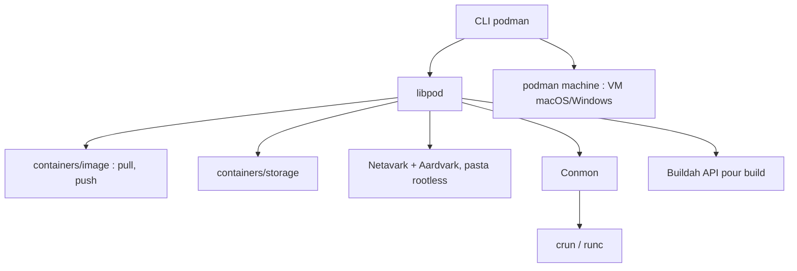

# podman-container-tools/podman

> Gestionnaire de conteneurs et de pods OCI sans démon, avec CLI compatible Docker.

## Le problème
Un démon conteneur tournant en root est une surface d'attaque permanente et consomme des ressources à vide.
Exécuter des conteneurs en utilisateur normal demande habituellement un binaire setuid.

## Ce que ça fait vraiment
Gère images, conteneurs, volumes et pods (groupes de conteneurs partageant des ressources) ; images OCI et Docker, pull avec vérification de confiance, push vers registres.
Cycle de vie complet : création depuis une image ou un rootfs éclaté, exécution, checkpoint/restauration via CRIU, suppression ; réseau par Netavark et Aardvark, rootless via pasta.
Pas de démon : moins de surface d'attaque et pas de consommation au repos ; API REST offrant une interface compatible Docker et une interface Podman étendue.
Rootless par namespaces utilisateur : un conteneur n'a jamais plus de privilèges que l'utilisateur qui l'a lancé. Sur macOS et Windows, tout passe par une VM `podman machine`.

## Comment c'est branché


## Essayer
```
$ podman run quay.io/podman/hello
```

## Coût et pièges
Gratuit. Une configuration administrateur préalable est nécessaire avant le rootless, documentée dans le guide d'installation.
Seule la version la plus récente reçoit le support amont ; exception pour la série v5.8, maintenue jusqu'en juin 2027 en CVE et correctifs critiques seulement.

## Ce que ce n'est pas
Ce n'est pas un outil de build d'images à part entière : Buildah s'en charge, Podman utilise son API Go.
Ce n'est pas un runtime CRI pour Kubernetes : c'est le rôle de CRI-O.
Ce n'est pas l'outil pour signer et pousser vers des backends de stockage variés : c'est Skopeo.

## Alternatives
- Buildah — construction d'images OCI sans Dockerfile ni privilèges root ; complémentaire plutôt que concurrent.
- CRI-O — le démon spécialisé pour l'interface CRI de Kubernetes.
- Skopeo — signature et transfert d'images entre backends de stockage.

## Pour toi
Remplacement direct de Docker sur ton poste et sur tes runners CI : même CLI, pas de démon root.
