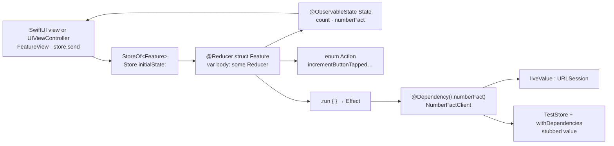

# pointfreeco/swift-composable-architecture

> **An application architecture for Apple developers: state, actions, reducers and testable effects.**

## The problem

Without a framework, the logic of a SwiftUI application scatters across observable objects, button
closures and network calls fired from the view: nothing is isolated, and testing a user flow means
testing the UI itself, at the mercy of connectivity and of the servers being called. Splitting a
large feature into reusable modules becomes a matter of personal discipline rather than a property
of the code.

## What it actually does

TCA prescribes four types per feature, as described in the README: **State** (the data), **Action**
(everything that can happen, including an API response), **Reducer** (how state evolves and which
effects are returned) and **Store** (the runtime that runs it all and that the view observes). The
`@Reducer` and `@ObservableState` macros generate the plumbing; `Reduce` describes transitions and
`.run { … }` wraps asynchronous work, each branch returning `.none` or an effect.

The library also ships a dependency system: you declare a client (`NumberFactClient`), conform it to
`DependencyKey` with its `liveValue`, then `@Dependency(\.…)` makes it available at any layer
without threading it through initialisers. In tests, `TestStore` replays a flow step by step:
`store.send(.incrementButtonTapped) { $0.count = 1 }` fails unless state changes exactly as
declared, and `store.receive(\.numberFactResponse)` forces you to account for every effect received.
Dependencies are overridden through `withDependencies`.

It targets SwiftUI and UIKit alike (the README shows a `UIViewController` driven by `observe`), on
iOS, macOS, iPadOS, visionOS, tvOS and watchOS. The repo carries a large `Examples` directory: case
studies, navigation, higher-order reducers, Search, SpeechRecognition, SyncUps, Tic-Tac-Toe, Todos,
VoiceMemos.

## How it is wired



No code-derived diagram exists for this repository: the graph above is reconstructed from the README
alone. What matters is the closed loop — the view never reaches the outside world directly, it sends
an action; only the effect touches the network, and that single crossing point is what makes testing
possible by substituting the dependency.

## Trying it

```bash
# The README documents no shell command: installation goes through the Xcode UI.
#   1. File > Add Package Dependencies...
#   2. paste https://github.com/pointfreeco/swift-composable-architecture
#   3. add the ComposableArchitecture product to your app target
#      (or to a shared framework if several targets depend on it, see Examples/TicTacToe)
```

The first code to write is the README's own:

```swift
import ComposableArchitecture

@Reducer
struct Feature {
}
```

## Cost and gotchas

- **Free and third-party-free**: MIT licence, no API key, no account, no quota. What the library
  calls a "dependency" is a dependency of *your* code, not of itself.
- **The real cost is Apple tooling**: Xcode, a macOS machine, and the Swift and platform versions
  advertised by the README badges. None of that installs through `pip` or `npm`.
- **The learning curve is the actual price.** The README half-admits it: "a few more steps" than
  plain SwiftUI for a simple counter. The teaching material (episodes, guided tour) lives on
  Point-Free, a subscription video platform; the API documentation itself is freely readable on
  Swift Package Index.
- **The README example calls `http://number-trivia.com` over plain HTTP**: an illustration, not a
  service to reuse.

## What it is not

- **Not a UI framework.** TCA draws nothing: views stay SwiftUI or UIKit. It organises the state and
  the effects behind them, nothing more.
- **Not portable outside the Apple ecosystem**: Swift, Xcode, Apple platforms. No Python, JavaScript
  or server-side equivalent is offered or mentioned.
- **Not a painless partial adoption**: the macros, `DependencyKey` injection and `TestStore` form a
  whole; you inherit the full style, not one isolated utility. The companion libraries listed
  (TCAComposer, TCACoordinators, Composable Architecture Extras) exist precisely to absorb the
  boilerplate this generates.

## Alternatives

| | When to prefer it |
|---|---|
| **ReSwift/ReSwift**, **ReactorKit/ReactorKit**, **spotify/mobius.swift** | Named by the README among other Swift architectures: same Elm/Redux lineage, fewer macros, smaller surface. Prefer them for unidirectional flow without TCA's testing and dependency machinery. |
| **uber/RIBs**, **square/workflow** | Also cited: component-based decomposition and architecture-driven navigation, aimed at large, often cross-platform apps (Android included). |
| **siteline/swiftui-introspect** | A catalogue neighbour, complementary rather than competing: it exposes the UIKit views under SwiftUI, it does not structure logic. The other neighbours (SwifterSwift, SwiftUIX, XcodesApp) are not comparable. |

## For you

Ignore it unless you ship Apple applications: this is an iOS/macOS architecture, unrelated to a data
or MLOps stack. The transferable idea, though, outlives Swift — isolating every call to the outside
world behind a substitutable dependency so a flow can be replayed in tests is exactly what most
pipelines lack.
