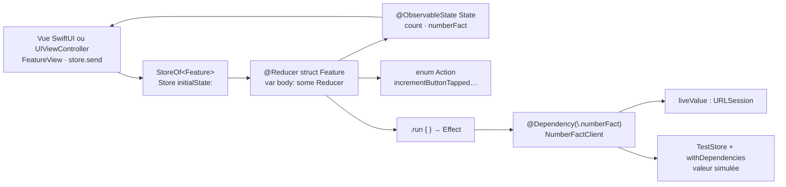

# pointfreeco/swift-composable-architecture

> **Une architecture applicative pour développeurs Apple : état, actions, réducteurs et effets testables.**

## Le problème

Sans cadre, la logique d'une application SwiftUI se disperse entre objets observables, closures
de boutons et appels réseau lancés depuis la vue : rien n'est isolable, et tester un parcours
utilisateur revient à tester l'interface elle-même, au gré de la connectivité et des serveurs
appelés. Découper une grande fonctionnalité en modules réutilisables devient une affaire de
discipline personnelle plutôt qu'une propriété du code.

## Ce que ça fait vraiment

TCA impose quatre types par fonctionnalité, décrits dans le README : **State** (les données),
**Action** (tout ce qui peut arriver, y compris la réponse d'une requête), **Reducer** (comment
l'état évolue et quels effets partent) et **Store** (le runtime qui exécute le tout et que la vue
observe). Les macros `@Reducer` et `@ObservableState` génèrent la plomberie ; `Reduce` décrit les
transitions et `.run { … }` encapsule l'asynchrone, chaque branche renvoyant `.none` ou un effet.

La bibliothèque fournit aussi un système d'injection de dépendances : on déclare un client
(`NumberFactClient`), on le conforme à `DependencyKey` avec sa `liveValue`, puis `@Dependency(\.…)`
le rend disponible à n'importe quelle couche sans le passer de main en main. En test, le
`TestStore` rejoue un parcours pas à pas : `store.send(.incrementButtonTapped) { $0.count = 1 }`
échoue si l'état ne change pas exactement comme annoncé, et `store.receive(\.numberFactResponse)`
oblige à assumer chaque effet reçu. Les dépendances se surchargent par `withDependencies`.

Le tout vise SwiftUI comme UIKit (le README montre un `UIViewController` piloté par `observe`), sur
iOS, macOS, iPadOS, visionOS, tvOS et watchOS. Le dépôt embarque un répertoire `Examples` fourni :
études de cas, navigation, réducteurs d'ordre supérieur, Search, SpeechRecognition, SyncUps,
Tic-Tac-Toe, Todos, VoiceMemos.

## Comment c'est branché



Aucun diagramme tiré du code n'existe pour ce dépôt : ce schéma est reconstruit depuis le seul
README. Le point à retenir est la boucle fermée — la vue n'appelle jamais le monde extérieur
directement, elle envoie une action ; seul l'effet touche le réseau, et c'est ce point de passage
unique qui rend le test possible en substituant la dépendance.

## Essayer

```bash
# Le README ne documente aucune commande shell : l'installation passe par l'interface d'Xcode.
#   1. menu File > Add Package Dependencies...
#   2. coller https://github.com/pointfreeco/swift-composable-architecture
#   3. ajouter le produit ComposableArchitecture à la cible de l'application
#      (ou à un framework partagé si plusieurs cibles en dépendent, cf. Examples/TicTacToe)
```

Le premier code à écrire est celui du README :

```swift
import ComposableArchitecture

@Reducer
struct Feature {
}
```

## Coût et pièges

- **Gratuit et sans service tiers** : licence MIT, aucune clé d'API, aucun compte, aucun quota.
  Ce que la bibliothèque appelle « dépendance » est une dépendance de *votre* code, pas la sienne.
- **Le coût réel est l'outillage Apple** : Xcode, une machine macOS, et les versions de Swift et de
  plateformes indiquées par les badges du README. Rien de tout cela ne s'installe par `pip` ou `npm`.
- **La courbe d'apprentissage est le vrai prix.** Le README l'admet à demi-mot : « quelques étapes de
  plus » qu'en SwiftUI classique pour un simple compteur. La matière pédagogique (épisodes, tour
  guidé) vit sur Point-Free, une plateforme vidéo par abonnement ; la documentation d'API, elle,
  est libre d'accès sur Swift Package Index.
- **L'exemple du README appelle `http://number-trivia.com` en clair** : c'est une illustration, pas
  un service à réutiliser.

## Ce que ce n'est pas

- **Ce n'est pas un framework d'interface.** TCA ne dessine rien : les vues restent SwiftUI ou UIKit.
  Il organise l'état et les effets derrière elles, rien de plus.
- **Ce n'est pas portable hors de l'écosystème Apple** : Swift, Xcode, plateformes Apple. Aucun
  équivalent Python, JavaScript ou serveur n'est proposé ni mentionné.
- **Ce n'est pas une adoption partielle indolore** : les macros, l'injection par `DependencyKey` et
  le `TestStore` forment un tout ; on hérite du style complet, pas d'un utilitaire isolé. Les
  bibliothèques compagnes citées (TCAComposer, TCACoordinators, Composable Architecture Extras)
  existent précisément pour absorber le code répétitif que cela engendre.

## Alternatives

| | Quand le préférer |
|---|---|
| **ReSwift/ReSwift**, **ReactorKit/ReactorKit**, **spotify/mobius.swift** | Nommées par le README parmi les autres architectures Swift : même filiation Elm/Redux, moins de macros et moins de surface. À préférer si l'on veut le flux unidirectionnel sans l'outillage de test ni l'injection de dépendances de TCA. |
| **uber/RIBs**, **square/workflow** | Également citées : découpage par composants et navigation pilotée par l'architecture, pensées pour de grandes applications multiplateformes (Android compris). |
| **siteline/swiftui-introspect** | Voisin du catalogue, complémentaire et non concurrent : il donne accès aux vues UIKit sous SwiftUI, il ne structure pas la logique. Les autres voisins (SwifterSwift, SwiftUIX, XcodesApp) ne sont pas comparables. |

## Pour toi

À ignorer sauf si tu livres des applications Apple : c'est une architecture iOS/macOS, sans rapport
avec une chaîne data ou MLOps. L'idée à retenir en revanche est transposable hors Swift — isoler
tout appel au monde extérieur derrière une dépendance substituable pour rendre un parcours
rejouable en test, c'est exactement ce qui manque à la plupart des pipelines.
