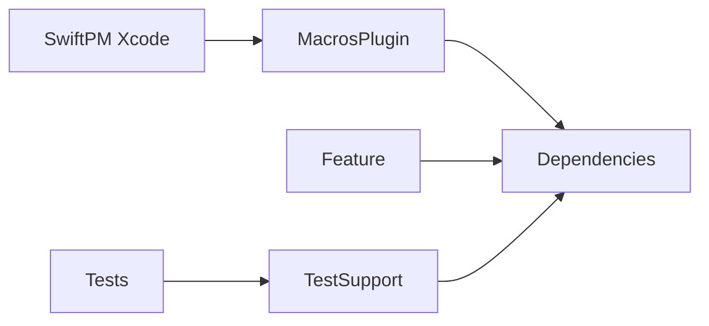

# pointfreeco/swift-dependencies

> Bibliothèque Swift de gestion de dépendances inspirée de l'environnement SwiftUI, pour rendre le code testable.

## Le problème
`Date()`, `UUID()`, horloges et clients réseau non contrôlés rendent les tests lents, non déterministes et les previews fragiles.

## Ce que ça fait vraiment
Déclare des dépendances via `@Dependency(\.clock)`, `\.date.now`, `\.uuid`, etc., les propage dans toute l'application et les surcharge par test ou preview avec le trait `.dependencies`. Fournit des horloges immédiates et des UUID incrémentaux. Des macros génèrent le code d'enregistrement.

## Comment c'est branché


## Essayer
```swift
.package(url: "https://github.com/pointfreeco/swift-dependencies", from: "1.0.0")
```
Puis ajouter `.product(name: "Dependencies", package: "swift-dependencies")` à la cible.

## Coût et pièges
Gratuit. Mieux adapté aux systèmes à point d'entrée unique.

## Ce que ce n'est pas
Pas une injection de dépendances générale pour d'autres langages. Ce n'est pas un framework de test en soi.

## Alternatives
Le README cite Factory, Needle, Swinject et Weaver.

## Pour toi
À ignorer sauf si tu écris des apps Swift : le principe de dépendances contrôlables est bon, mais l'outil est spécifique à Swift.

