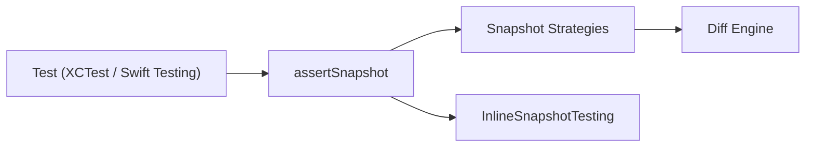

# pointfreeco/swift-snapshot-testing

> Bibliothèque Swift de tests par instantanés pour vues, requêtes URL et valeurs Codable.

## Le problème
Vérifier qu'une interface ou une structure de données n'a pas changé sans écrire des assertions à la main sur chaque détail.

## Ce que ça fait vraiment
`assertSnapshot(of:as:)` enregistre au premier passage un instantané sur disque (image, `recursiveDescription`, JSON, plist, dump), puis le compare aux exécutions suivantes. Les stratégies sont extensibles. Deux modules : `SnapshotTesting` et `InlineSnapshotTesting` (instantanés inline). Fonctionne sous iOS, macOS, tvOS et Linux, avec SceneKit, SpriteKit et WebKit.

## Comment c'est branché


## Essayer
```bash
assertSnapshot(of: vc, as: .image)
```
Installation via Swift Package Manager : ajouter le paquet `https://github.com/pointfreeco/swift-snapshot-testing` (from: "1.12.0") à une cible de test.

## Coût et pièges
Gratuit. Les instantanés doivent être comparés avec le même simulateur que celui de référence, sinon les images divergent. Ajouter le paquet à une cible de test, pas à l'application.

## Ce que ce n'est pas
Pas un outil pour tester des modèles ou des données ML : c'est du test d'interface et de valeurs Swift. 220 issues ouvertes.

## Alternatives
- iOSSnapshotTestCase : l'ancêtre qui a inspiré la bibliothèque.
- Jest : référence JavaScript du snapshot testing.

## Pour toi
À ignorer : outil de test Swift/iOS, sans intérêt pour un profil data, IA ou MLOps hors développement d'application Apple.

