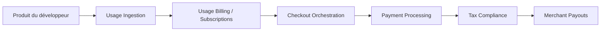

# polarsource/polar

> Plateforme de facturation et marchand officiel pour startups d'IA qui facturent jetons, agents et calcul.

## Le problème
Facturer à l'usage (jetons, appels, secondes de GPU) suppose de monter mesure, paiement, TVA et portail client soi-même.

## Ce que ça fait vraiment
Polar mesure les événements d'usage, gère abonnements, sièges, crédits, essais et remises, orchestre le paiement, calcule les taxes en tant que marchand officiel, puis verse les revenus. Il offre un checkout, un portail client, un tableau de bord (web et mobile) et une API publique avec webhooks. Des SDK JavaScript et Python existent. Le détail du code serveur n'a pas été exploré dans l'architecture fournie.

## Comment c'est branché

## Essayer
Aucune commande documentée dans le README : l'intégration passe par l'API publique, les webhooks et les SDK `polar-js` et `polar-python`. `DEVELOPMENT.md` décrit l'environnement de développement.

## Coût et pièges
Commission par transaction : Starter 5,00 % + 0,50 $, Pro 3,80 % + 0,40 $, Growth 3,60 % + 0,35 $, Scale 3,40 % + 0,30 $, hors frais additionnels. Programme startup possible pour un an de plan avancé.

## Ce que ce n'est pas
Pas un simple logiciel à installer : la valeur est le service hébergé qui porte la conformité fiscale. Le README ne documente pas l'auto-hébergement.

## Alternatives
Aucune alternative nommée dans le README.

## Pour toi
À surveiller : intéressant si tu factures un produit d'IA à l'usage, mais tu dépends d'un service tiers avec commission ; à comparer avant d'engager.

