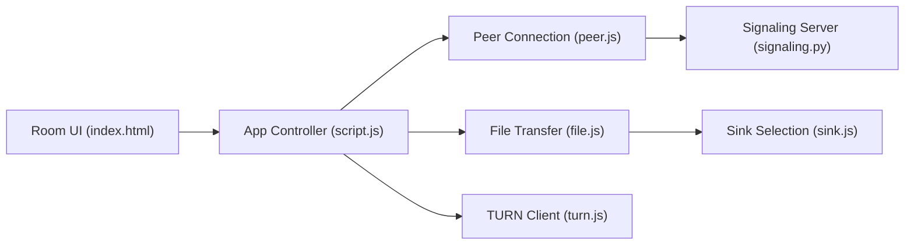

# polius/FileSync

> Application web autohébergée pour envoyer des fichiers en pair à pair entre navigateurs.

## Le problème
Envoyer un gros fichier à plusieurs appareils sans compte, sans cloud et sans limite de taille.

## Ce que ça fait vraiment
Les fichiers passent directement d'un navigateur à l'autre en WebRTC chiffré ; un serveur WebSocket ne sert qu'à la mise en relation (SDP, ICE). Écriture au fil de l'eau (API File System Access, service worker, sinon blob mémoire), reprise automatique, salle partagée par lien ou QR code avec mot de passe. TURN intégré pour les cas sans connexion directe.

## Comment c'est branché


## Essayer
```bash
docker compose up -d
docker compose -f docker-compose-ssl.yml up -d
```

## Coût et pièges
Docker et Compose ; ports 80/443, 3478 (TCP+UDP) et UDP 50000-50100 pour le relais TURN. HTTPS recommandé, sinon repli sur le blob en mémoire.

## Ce que ce n'est pas
Pas un outil de stockage ni de synchronisation continue malgré son nom : c'est un transfert à la volée entre appareils connectés.

## Alternatives
- fsend : équivalent en ligne de commande cité par l'auteur.

## Pour toi
À ignorer pour ton métier : bon outil de transfert ponctuel, mais sans rapport avec la data ou l'IA.
