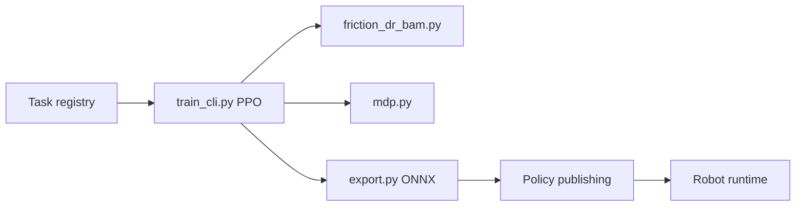

# pollen-robotics/microduck_rl

> Environnements d'apprentissage par renforcement pour le robot bipède Microduck, entraînés avec mjlab et PPO.

## Le problème
Transférer une politique de marche d'un petit robot (800 g) de la simulation au réel échoue souvent à cause de l'écart actionneurs/jeu mécanique.

## Ce que ça fait vraiment
Tâches mjlab (marche, relevé, sit/stand, roulade, tir, patins à roulettes) entraînées en PPO à 50 Hz. Modèle d'actionneur BAM avec randomisation de domaine et simulation du jeu d'engrenages, observation partagée de 61 dimensions pour permuter les politiques. Export ONNX avec normalisation intégrée, publication sur Hugging Face Hub, entraînement possible via HF Jobs. Tests CPU de régression.

## Comment c'est branché


## Essayer
```bash
git clone https://github.com/pollen-robotics/microduck_rl
cd microduck_rl
uv run train Mjlab-Velocity-Flat-MicroDuck --env.scene.num-envs 4096
uv run scripts/export.py Mjlab-Velocity-Flat-MicroDuck --wandb-run-path <...>
uv run scripts/infer_policy.py --walking output.onnx
```

## Coût et pièges
GPU CUDA requis (ou HF Jobs). Environ 1–2 h pour une marche exploitable à 4096 envs ; `uv sync` télécharge ~2 Go.

## Ce que ce n'est pas
Pas un framework RL générique : spécifique à Microduck, utile surtout avec le robot et le runtime `pollen-robotics/microduck`.

## Alternatives
Aucune alternative nommée dans le README (il s'appuie sur mjlab et BAM).

## Pour toi
À surveiller : bonne référence de recette sim2real (actionneur, DR, ONNX) à lire même sans robot ; sinon trop spécifique.

