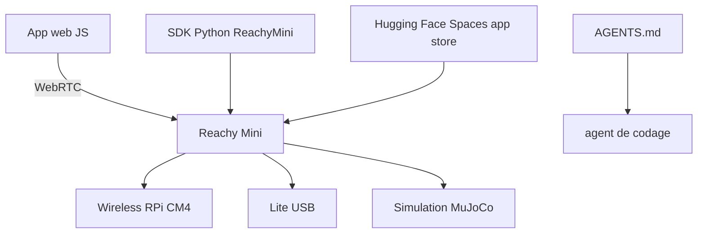

# pollen-robotics/reachy_mini

> SDK Python et JavaScript pour piloter le petit robot expressif Reachy Mini, avec un mode simulation.

## Le problème
Prototyper un comportement robotique demande d'ordinaire un robot, un environnement de build et une chaîne de déploiement séparés.
Partager une démo suppose que la personne en face installe la même pile.

## Ce que ça fait vraiment
Trois plateformes : Wireless (Raspberry Pi CM4, batterie, WiFi, IMU embarquée), Lite (branché en USB sur l'ordinateur) et Simulation (MuJoCo, sans matériel).
Le SDK Python contrôle la pose de la tête et les boucles de contrôle embarquées ; `goto_target` avec `create_head_pose` suffit pour un premier mouvement.
Le chemin recommandé pour une nouvelle application est le SDK JavaScript : une page statique qui pilote le robot en WebRTC depuis un navigateur, sans installation côté utilisateur.
Un magasin d'applications adossé aux Spaces Hugging Face permet d'installer conversation, radio ou suivi de main en un clic depuis le tableau de bord du robot.

## Comment c'est branché


## Essayer
```python
from reachy_mini import ReachyMini
from reachy_mini.utils import create_head_pose

with ReachyMini() as mini:
    mini.goto_target(head=create_head_pose(z=10, roll=15, degrees=True, mm=True), duration=1.0)
```

## Coût et pièges
Le robot s'achète en kit et demande 2 à 3 heures de montage ; seule la simulation MuJoCo est gratuite.
Le magasin d'applications passe par Hugging Face, donc un compte et une dépendance à leur infrastructure. `uv` accélère les installations, avec repli sur `pip`.

## Ce que ce n'est pas
Pas un robot autonome clé en main : la version Lite reste branchée à l'ordinateur et alimentée sur secteur.
Pas une plateforme industrielle : le README vise explicitement les bricoleurs et les constructeurs d'IA.
L'application conversationnelle repose sur des LLM, donc sur un service et un coût externes non détaillés ici.

## Alternatives
Aucune alternative nommée dans le README.

## Pour toi
À écarter sauf envie personnelle de robotique : rien dans ta chaîne data ne s'y branche.
