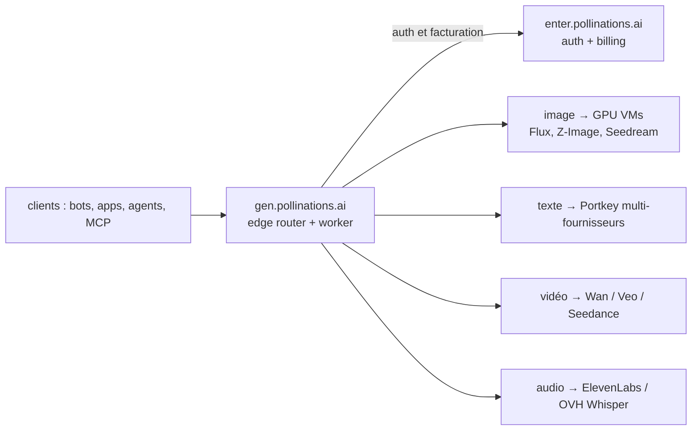

# pollinations/pollinations

> Plateforme générative ouverte : texte, image, audio, vidéo, 3D et embeddings sur un endpoint.

## Le problème
Assembler une démo multimodale oblige à ouvrir un compte, une facturation et un SDK par modalité,
chez trois ou quatre fournisseurs différents.

## Ce que ça fait vraiment
Expose `gen.pollinations.ai` comme endpoint unique pour toutes les générations, avec facturation en
crédits « Pollen » ($1 ≈ 1 Pollen) et deux types de clés : `pk_` pour les clients publics, budget et
permissions fixés à la création, `sk_` pour le serveur uniquement. L'API est compatible OpenAI, donc
les SDK officiels marchent en changeant le `baseURL`. Les identifiants de modèles suivent désormais
`publisher/model` (`flux` → `black-forest-labs/flux.1-schnell`), les anciens restant des alias. On
peut enregistrer un « agent géré » (prompt système + modèle de base + outils) et l'appeler comme un
modèle ordinaire par `owner/agent-name`. Un serveur MCP hébergé et un CLI `polli` complètent.

## Comment c'est branché


## Essayer
```bash
curl -H "Authorization: Bearer YOUR_API_KEY" 'https://gen.pollinations.ai/image/a%20beautiful%20sunset' -o image.jpg
curl 'https://gen.pollinations.ai/text/Hello%20world?key=YOUR_API_KEY'
curl 'https://gen.pollinations.ai/v1/audio/transcriptions' -H "Authorization: Bearer YOUR_API_KEY" -F file=@audio.mp3 -F model=whisper-large-v3
curl 'https://gen.pollinations.ai/v1/embeddings' -H 'Content-Type: application/json' -H 'Authorization: Bearer YOUR_API_KEY' -d '{"model": "openai-3-small", "input": "Hello world!"}'
npx @pollinations/cli gen image "cyberpunk city at night" --model flux --output city.png
npm install -g @pollinations/cli
export POLLINATIONS_API_KEY=sk_...
```

## Coût et pièges
Freemium : les Pollen s'achètent, mais se gagnent aussi par des « Quests » sans carte bancaire. Les
clés `sk_` ne doivent jamais partir côté client ; les clients navigateur passent la clé en paramètre
d'URL pour le WebSocket temps réel, ce qui l'expose dans les logs. Toute la facturation dépend d'un
service unique.

## Ce que ce n'est pas
Pas un modèle ni un runtime : c'est un routeur devant Flux, GPT, Claude, Gemini, Seedream, ElevenLabs
et compagnie, avec leurs limites et leurs pannes. Pas auto-hébergeable en pratique : le dépôt
contient les Workers et le front, mais rien n'indique comment tourner sans leur infra.

## Alternatives
- Les SDK OpenAI / Vercel AI SDK pointés directement sur les fournisseurs : moins de dépendance.

## Pour toi
Utile pour une démo multimodale montée en une heure ; pas pour du traitement récurrent.
