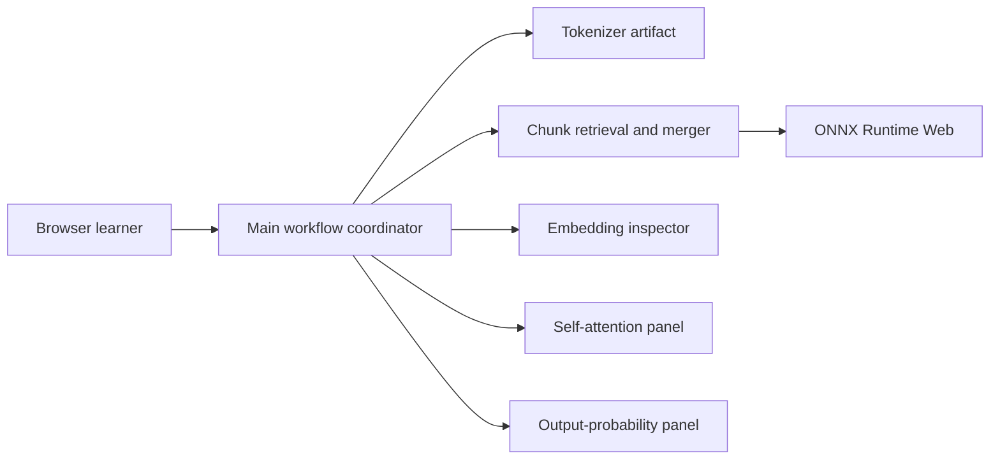

# poloclub/transformer-explainer

> Visualisation interactive de Georgia Tech qui fait tourner GPT-2 dans le navigateur pour expliquer les Transformers.

## Le problème
Comprendre attention, QKV et softmax de sortie à partir d'équations reste abstrait pour la plupart des apprenants.

## Ce que ça fait vraiment
Application SvelteKit qui charge le tokenizer GPT-2 et un modèle ONNX découpé en 63 morceaux, exécuté par ONNX Runtime Web. Tu tapes un texte, tu ajustes température et échantillonnage, et tu vois embeddings, projections QKV, attention, MLP et probabilités du jeton suivant. Des résultats en cache servent pendant le chargement ; un manuel interactif et un article accompagnent. Papier CHI 2026.

## Comment c'est branché


## Essayer
```bash
git clone https://github.com/poloclub/transformer-explainer.git
cd transformer-explainer
npm install
npm run dev
```

## Coût et pièges
Gratuit, utilisable en ligne sans installation ; en local, Node 20 et NPM 10. L'app pousse des événements d'usage vers `window.dataLayer` (Google Tag Manager).

## Ce que ce n'est pas
Pas un outil d'interprétabilité pour tes propres modèles : figé sur GPT-2 small. Pas de backend d'inférence.

## Alternatives
- Diffusion Explainer : même équipe, pour Stable Diffusion.
- CNN Explainer et GAN Lab : autres explicateurs interactifs du même labo.

## Pour toi
À adopter comme support pédagogique : c'est la façon la plus rapide de montrer à une équipe ce que fait vraiment un Transformer, sans installation et sur un vrai modèle.
