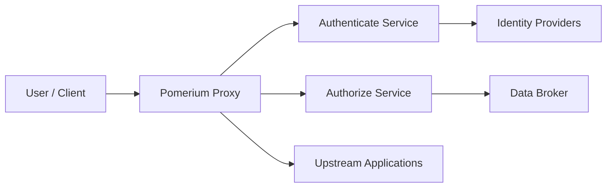

# pomerium/pomerium

> Proxy inverse Go sensible à l'identité, qui remplace le VPN pour l'accès aux applis internes.

## Le problème
Donner accès à des applis internes sans VPN, en vérifiant l'identité et le contexte de chaque requête.

## Ce que ça fait vraiment
Un binaire unique (`cmd/pomerium`) regroupe quatre services : proxy, authenticate (login OIDC/SAML), authorize (évaluation des politiques) et databroker (état et configuration via gRPC). La config est poussée vers Envoy par xDS. Une interface React est embarquée. Pomerium Zero, un plan de contrôle hébergé, est optionnel.

## Comment c'est branché

## Essayer
Aucune commande documentée dans le README fourni (renvoi à la documentation externe).

## Coût et pièges
Il faut un fournisseur d'identité externe. Le plan de contrôle hébergé Pomerium Zero est une offre à part.

## Ce que ce n'est pas
Ce n'est pas présenté comme un VPN alternatif, mais comme une autre approche. Le README ne détaille ni installation ni configuration.

## Alternatives
- Pomerium Zero : même produit avec plan de contrôle et interface de gestion hébergés.

## Pour toi
À surveiller : utile si tu exposes des outils internes (MLflow, notebooks) sans VPN, mais hors du cœur data/IA.

