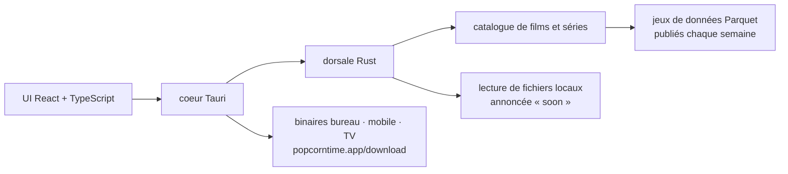

# popcorn-official/popcorn-desktop

> **A desktop catalogue-and-playback application, rebuilt from scratch on Tauri, Rust and React.**

## The problem

Finding where to watch a film means going through directories — the README names JustWatch and
Reelgood — which point at a service and stop there: you click through to a platform, with no
local playback and no access to the underlying catalogue data. For a developer or a researcher,
there is no open dataset of those catalogues: the directory keeps its database to itself.

## What it actually does

The README announces a **complete rebuild** of Popcorn Time: "not a fork, not a patch", a fresh
start, with this repository becoming the home for development, documentation and releases. Four
things are claimed:

- a cross-platform application targeting **desktop, mobile and TV**;
- a **catalogue published weekly as Parquet** datasets for developers and researchers, tracked in
  issue #3113 (the README's link actually points at issue #3115);
- **playback of your own files**, not just links — but the README explicitly writes "soon", so it
  is not there yet;
- direction set by contributors rather than by a company.

The README calls the result "modern, safer, and legal" without documenting what that "legal"
covers. Beyond those four points it describes neither the catalogue's sources, nor the player,
nor the exact dataset format: the technical material stops at the stack.

## How it is wired

No code-derived diagram exists for this repository: this one is reconstructed from the README
alone, which states a Tauri application, a React interface in TypeScript and a Rust backend, plus
the icon `crates/popcorntime-tauri/icons/release/128x128@2x.png` — the only file path the README
exposes, and the one hint that the Rust side is organised in crates.

## Trying it

The README gives **no command at all**: no install, no build, no launch. It points to two files
not read here, `CONTRIBUTING.md` for contributing and `DEVELOPMENT.md` "to skip right to getting
the code to actually compile". For a plain trial it points at the site `popcorntime.app`, with
nightly builds described as unstable at `popcorntime.app/download#nightly`.

## Cost and traps

- **Licence**: the README claims an "MIT-licensed open source project", but the catalogue row
  declares no licence at all — no licence, no language, no star count. The intent is written, the
  verification is not: check the repository's licence file before any use. Hence the alert.
- **Name mismatch**: the catalogue slug is `popcorn-official/popcorn-desktop`, while every link in
  the README (CI badges, issues, sponsors, DeepWiki) points at `popcorntime/popcorntime`. Check
  which repository you land on before cloning.
- **Nothing stable to install**: only "unstable" nightly builds are announced, and the feature put
  forward as the differentiator — local file playback — is marked "soon".
- **The "legal" claim is undocumented.** The Popcorn Time name carries a legal history; the README
  offers the adjective without explaining what changed. Do not read it as a guarantee.
- **Building**: a Tauri project, so both a Rust toolchain and a Node/TypeScript toolchain if you
  want to build it yourself. The details live in `DEVELOPMENT.md`, outside the README.
- **Hosting dependencies**: Cloudflare and DigitalOcean appear as sponsors; binaries and datasets
  are distributed through the project's own site.

## What it is not

- **Not the historical Popcorn Time codebase**: the README says "not a fork, not a patch". What
  you know about the old project does not carry over.
- **Not yet a local file player**: the promise is dated "soon" in the README itself. As of this
  README the application stays on the catalogue side.
- **Not a library or a service you integrate**: no API, no package, no call example. It is an
  application to install, plus datasets published separately.
- **Not a streaming-directory site** like JustWatch or Reelgood: the README explicitly sets itself
  apart from them, without saying how content access actually works.
- **The Parquet dataset is not described**: no schema, no volume, no data licence, no download URL
  in the README. All we know is that it is weekly.

## Alternatives

No comparable alternative in the catalogue: the lot row offers **no neighbour** at all (licence,
language and neighbours are all empty), and the only two names the README cites, JustWatch and
Reelgood, are closed commercial services rather than repositories — treating them as alternatives
would invent a code relationship that does not exist.

## For you

For a data profile the only angle is the **dataset**: a catalogue of films and shows published
weekly as Parquet and opened to researchers is a plausible source for recommender work or
metadata analysis. But nothing is verifiable from the README yet — no schema, no volume, no data
licence, no download link — and the application itself holds no technical interest on the AI/MLOps
side. Worth watching until the catalogue issue lands; nothing to install today.
