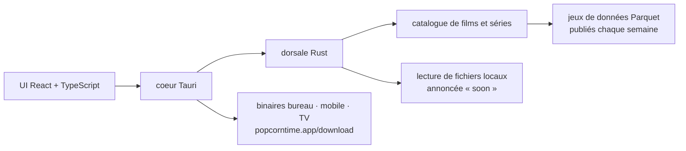

# popcorn-official/popcorn-desktop

> **Application de bureau de catalogue et de lecture vidéo, réécrite de zéro en Tauri, Rust et React.**

## Le problème

Chercher où regarder un film oblige à passer par des annuaires — le README nomme JustWatch et
Reelgood — qui indiquent un service et s'arrêtent là : on clique vers une plateforme, sans
lecture locale et sans accès aux données du catalogue. Côté développeur ou chercheur, il n'existe
pas de jeu de données ouvert sur ces catalogues : l'annuaire garde sa base pour lui.

## Ce que ça fait vraiment

Le README annonce une **reconstruction complète** de Popcorn Time : « ni un fork, ni un patch »,
un nouveau départ, ce dépôt devenant le lieu du développement, de la documentation et des
publications. Quatre choses sont revendiquées :

- une application multiplateforme visant **bureau, mobile et TV** ;
- un **catalogue publié chaque semaine en Parquet**, à destination des développeurs et des
  chercheurs, suivi dans l'issue #3113 (le lien du README pointe en réalité sur l'issue #3115) ;
- la **lecture de ses propres fichiers**, pas seulement le renvoi vers un lien — mais le README
  écrit explicitement « soon », donc ce n'est pas encore là ;
- un pilotage par les contributeurs plutôt que par une entreprise.

Le README qualifie l'ensemble de « modern, safer, and legal » sans rien documenter de ce que
recouvre ce « legal ». Au-delà de ces quatre points, le README ne décrit ni les sources du
catalogue, ni le lecteur, ni le format exact des jeux de données : la matière technique se
limite à la pile.

## Comment c'est branché

Aucun diagramme tiré du code n'existe pour ce dépôt : ce schéma est reconstruit depuis le seul
README, qui indique une application Tauri, une interface React en TypeScript et une dorsale en
Rust, plus l'icône `crates/popcorntime-tauri/icons/release/128x128@2x.png` — seul chemin de
fichier que le README expose, et qui confirme l'organisation en crates Rust.

## Essayer

Le README ne donne **aucune commande** : ni installation, ni compilation, ni lancement. Il
renvoie à deux fichiers non lus ici, `CONTRIBUTING.md` pour contribuer et `DEVELOPMENT.md`
« pour arriver directement à faire compiler le code ». Pour un simple essai, il pointe le site
`popcorntime.app`, et des versions nightly qualifiées d'instables sur
`popcorntime.app/download#nightly`.

## Coût et pièges

- **Licence** : le README affirme « MIT-licensed open source project », mais la ligne du lot ne
  déclare aucune licence — ni licence, ni langage, ni nombre d'étoiles. L'intention est écrite,
  la vérification n'est pas faite : à lever sur le fichier de licence du dépôt avant tout usage.
  C'est la raison de l'alerte.
- **Écart de nom** : le slug du catalogue est `popcorn-official/popcorn-desktop`, alors que tous
  les liens du README (badges d'intégration continue, issues, sponsors, DeepWiki) pointent sur
  `popcorntime/popcorntime`. Vérifier sur quel dépôt on atterrit avant de cloner.
- **Rien de stable à installer** : seules des nightly « unstable » sont annoncées, et la
  fonctionnalité mise en avant pour se distinguer — la lecture de fichiers locaux — est marquée
  « soon ».
- **Le « legal » n'est pas documenté.** Le nom Popcorn Time traîne un passé juridique ; le README
  se contente de l'adjectif, sans expliquer ce qui change. À ne pas prendre pour une garantie.
- **Compilation** : projet Tauri, donc chaîne Rust *et* chaîne Node/TypeScript à installer si on
  veut construire soi-même. Le détail est dans `DEVELOPMENT.md`, hors README.
- **Dépendances d'hébergement** : Cloudflare et DigitalOcean figurent en sponsors ; la
  distribution des binaires et des jeux de données passe par le site du projet.

## Ce que ce n'est pas

- **Ce n'est pas la base de code historique de Popcorn Time** : le README dit « not a fork, not a
  patch ». Ce qu'on sait de l'ancien projet ne s'applique pas ici.
- **Ce n'est pas encore un lecteur de fichiers locaux** : la promesse est datée « soon » dans le
  README lui-même. À la date du README, l'application reste du côté du catalogue.
- **Ce n'est pas une bibliothèque ni un service qu'on intègre** : pas d'API, pas de paquet, pas
  d'exemple d'appel. C'est une application à installer, plus des jeux de données publiés à part.
- **Ce n'est pas un annuaire de plateformes de streaming** comme JustWatch ou Reelgood : le
  README s'en démarque explicitement, sans dire ce que devient l'accès aux contenus.
- **Le dataset Parquet n'est pas décrit** : ni schéma, ni volume, ni licence de données, ni URL
  de téléchargement dans le README. On sait seulement qu'il est hebdomadaire.

## Alternatives

Aucune alternative comparable dans le catalogue : la ligne du lot ne propose **aucun voisin**
(licence, langage et voisins sont tous vides), et les deux seuls noms cités par le README,
JustWatch et Reelgood, sont des services commerciaux fermés, pas des dépôts — les retenir comme
alternatives reviendrait à inventer un lien de code qui n'existe pas.

## Pour toi

Pour un profil data, le seul angle est le **jeu de données** : un catalogue de films et de séries
publié chaque semaine en Parquet, ouvert aux chercheurs, c'est une source potentielle pour du
système de recommandation ou de l'analyse de métadonnées. Mais rien n'est encore vérifiable
depuis le README — ni schéma, ni volume, ni licence des données, ni lien de téléchargement — et
l'application elle-même n'a aucun intérêt technique côté IA/MLOps. À surveiller le temps que
l'issue du catalogue aboutisse ; rien à installer aujourd'hui.
