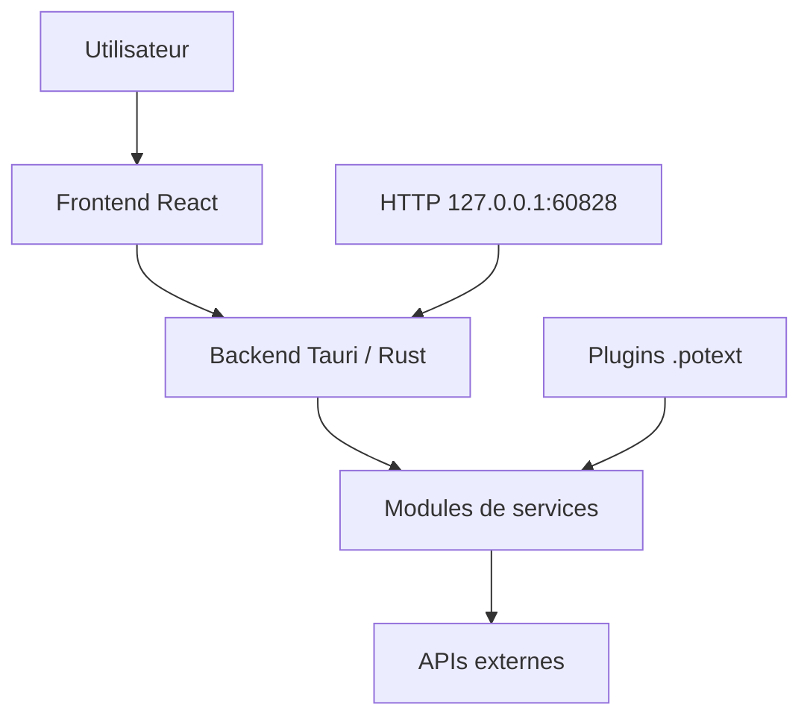

# pot-app/pot-desktop

> Traducteur de texte sélectionné multiplateforme, avec OCR et plusieurs moteurs, pour utilisateurs de bureau.

## Le problème
Traduire un texte à l'écran oblige à copier, ouvrir un site, coller. Encore plus pour du texte dans une image.

## Ce que ça fait vraiment
Application Tauri (frontend React, backend Rust) : traduction par sélection, saisie, presse-papiers, OCR d'écran et traduction de capture. Elle interroge en parallèle de nombreux services (OpenAI, Gemini, DeepL, Google, Ollama en local, etc.), propose l'OCR système ou Tesseract, la synthèse vocale et l'export vers Anki. Un serveur HTTP local (port 60828) permet de l'appeler depuis d'autres outils. Système de plugins `.potext`. Le README est en chinois.

## Comment c'est branché


## Essayer
```bash
winget install Pylogmon.pot
brew tap pot-app/homebrew-tap
brew install --cask pot
pnpm install
pnpm tauri dev
```

## Coût et pièges
Le logiciel est gratuit, mais la plupart des moteurs demandent une clé d'API ou envoient ton texte à des tiers. Le dépôt est archivé (dernier push 2026-07-04) : plus de correctifs attendus. Sous Wayland, raccourcis et capture intégrés ne fonctionnent pas.

## Ce que ce n'est pas
Ce n'est pas un moteur de traduction : c'est un client qui agrège des services tiers.

## Alternatives
Le README cite Bob (macOS) comme source d'inspiration, sans le présenter comme alternative directe.

## Pour toi
À ignorer : archivé et hors sujet pour un profil data/IA ; le principe (agréger plusieurs LLM de traduction) s'imite en quelques scripts.

