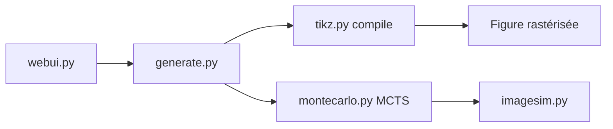

# potamides/DeTikZify

> Modèle multimodal qui transforme croquis et figures scientifiques en programmes TikZ compilables.

## Le problème
Recréer une figure scientifique en vecteurs TikZ à partir d'une image ou d'un croquis est long.

## Ce que ça fait vraiment
Génère du code TikZ depuis une image, ou depuis un texte avec TikZero et TikZero+. Un algorithme MCTS raffine les sorties sans réentraînement, en classant les candidats par similarité d'image. Le code TikZ est compilé et rastérisé. Interface web, poids et jeux de données sur Hugging Face (DaTikZ allégé pour cause de licence arXiv).

## Comment c'est branché


## Essayer
```bash
pip install 'detikzify[legacy] @ git+https://github.com/potamides/DeTikZify'
python -m detikzify.webui --light
```

## Coût et pièges
Exige TeX Live 2023, ghostscript et poppler ; GPU pour les modèles 8b/10b. Un Space Hugging Face et un notebook Colab (1b seulement en gratuit) existent.

## Ce que ce n'est pas
Pas un éditeur de figures : la sortie reste à relire. Le jeu de données public est incomplet.

## Alternatives
Aucune alternative nommée dans le README (il s'appuie sur AutomaTikZ).

## Pour toi
À surveiller : démonstration concrète de génération de code guidée par rendu et recherche MCTS, utile si tu fais des figures TikZ ; sinon niche.

