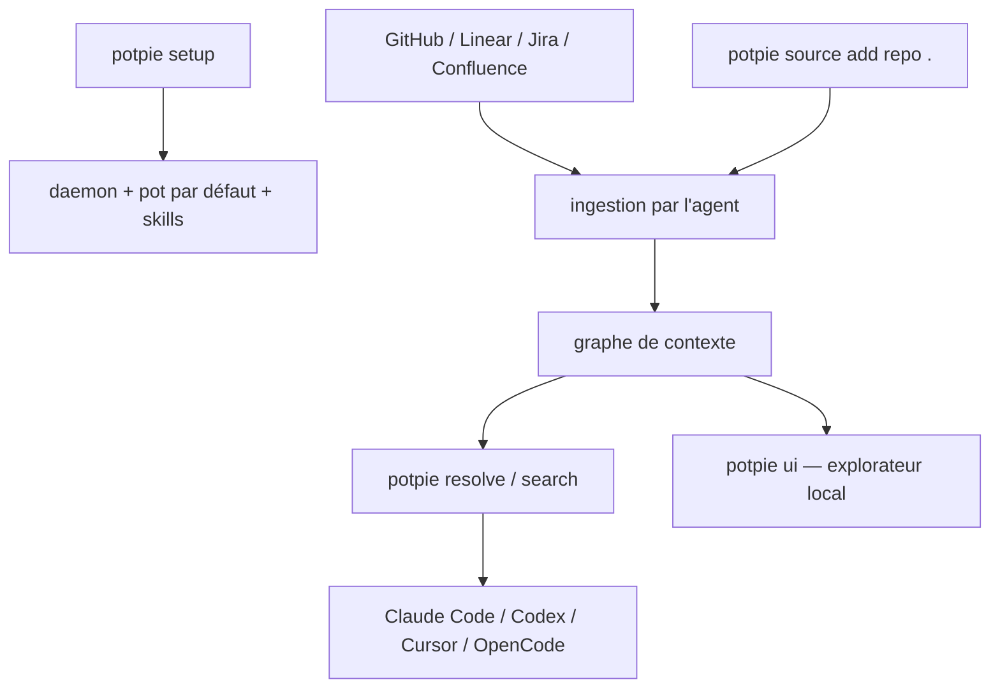

# potpie-ai/potpie

> Graphe de contexte local qui indexe code, historique et tickets pour tes agents.

## Le problème
Un agent qui découvre un dépôt ne connaît ni les décisions passées, ni les conventions, ni le lien entre un ticket et le code qui l'implémente.
Chaque session recommence l'exploration à zéro.

## Ce que ça fait vraiment
Il indexe le code, sa structure, les décisions, l'historique des sources, la connaissance d'équipe et les workflows d'ingénierie dans un graphe de contexte.
`potpie resolve "..."` sort le contexte qu'un agent devrait lire avant une tâche ; `potpie search "..."` cible un fichier, un bug, une décision ou une convention.
`potpie record --type decision --summary "..."` écrit un apprentissage durable dans le graphe, que les sessions suivantes retrouveront.
Les intégrations couvrent GitHub (dépôts, PR, issues, revues), Linear, Jira et Confluence ; les harnais supportés sont Claude Code, Codex, Cursor et OpenCode.

## Comment c'est branché


## Essayer
```bash
uv tool install potpie
potpie setup --repo . --agent claude
potpie github login
potpie source add repo .
potpie resolve "what should I know before working in this repository?"
potpie search "authentication flow"
potpie ui
```

## Coût et pièges
`potpie login` existe pour les « fonctions managées et adossées au compte » : une partie de la valeur est derrière un compte, sans grille tarifaire dans le README.
L'indexation touche le code, les PR et les tickets — à considérer avant de la brancher sur un dépôt privé d'entreprise.

## Ce que ce n'est pas
Ce n'est pas un agent : il produit du contexte que ton harnais consomme. Ce n'est pas un index à lancer à la main non plus — pas de commande d'ingestion, l'agent le fait quand la tâche l'exige.
L'architecture est déclarée « CLI-first » et le README renvoie à `docs/context-graph/architecture.md` pour les détails.

## Alternatives
Aucune alternative n'est nommée dans le README.

## Pour toi
L'idée d'une mémoire projet partagée entre sessions est solide ; vérifie ce qui exige `potpie login` avant d'y investir.
