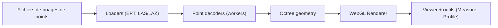

# potree/potree

> Visionneuse WebGL open source pour afficher de très gros nuages de points dans un navigateur.

## Le problème
Un nuage de points de milliards de points ne s'ouvre pas tel quel dans un navigateur.

## Ce que ça fait vraiment
Des chargeurs lisent les formats Potree, EPT et LAS/LAZ ; des workers décodent les attributs ; une géométrie en octree fournit les points visibles ; le rendu WebGL s'appuie sur three.js. Outils de mesure, profils, découpe, annotations, animation de caméra, export, intégration optionnelle de Cesium et de WebXR. Les nuages doivent d'abord être convertis avec PotreeConverter.

## Comment c'est branché


## Essayer
```bash
npm install
npm start
# puis http://localhost:1234/examples/
# conversion : ./PotreeConverter.exe C:/pointclouds/data.las -o C:/pointclouds/data_converted
```

## Coût et pièges
Gratuit. Node seulement pour construire ; un simple hébergement de fichiers suffit pour servir. Licence « présente mais non identifiée » par GitHub : à lire. Dernier push le 2026-01-08.

## Ce que ce n'est pas
Pas un logiciel de traitement de nuages de points : c'est un visualiseur. Les données doivent être converties d'abord.

## Alternatives
Aucune alternative nommée dans le README (PotreeConverter et PotreeDesktop sont des compagnons).

## Pour toi
À surveiller : utile si tu dois publier des relevés LiDAR ou photogrammétriques dans une page web ; hors sujet pour de la donnée tabulaire.

