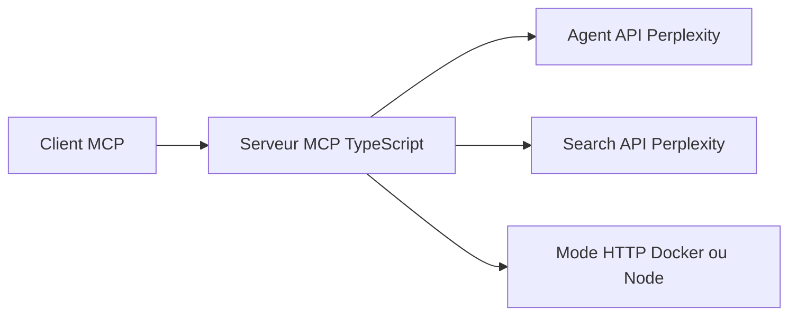

# ppl-ai/modelcontextprotocol

> Serveur MCP officiel de Perplexity qui donne recherche web et raisonnement à un assistant.

## Le problème
Un assistant sans accès au web répond avec des connaissances datées.

## Ce que ça fait vraiment
Quatre outils : `perplexity_search` (résultats classés, filtres de récence et de domaine), `perplexity_ask`, `perplexity_reason` et `perplexity_research` (recherche longue en streaming), adossés à des presets de l'Agent API. Serveur distant hébergé (`https://api.perplexity.ai/mcp`), serveur local via npx, mode HTTP auto-hébergé (Docker ou Node), usage en bibliothèque, proxy d'entreprise.

## Comment c'est branché


## Essayer
```bash
claude mcp add perplexity --env PERPLEXITY_API_KEY="your_key_here" -- npx -y @perplexity-ai/mcp-server
claude mcp add --transport http perplexity https://api.perplexity.ai/mcp --header "Authorization: Bearer YOUR_API_KEY"
```

## Coût et pièges
Clé d'API Perplexity obligatoire et facturation à ta charge. La recherche approfondie peut durer plusieurs minutes (délai par défaut de 5 minutes). En HTTP, bind par défaut en loopback.

## Ce que ce n'est pas
Ce n'est pas un moteur de recherche autonome : tout dépend du SaaS Perplexity. L'ancienne version appelait les modèles `sonar-*` ; ces paramètres sont désormais ignorés.

## Alternatives
Aucune alternative nommée dans le README.

## Pour toi
À surveiller : commode pour brancher du web à ton agent, mais payant à l'usage et verrouillé sur un fournisseur.
