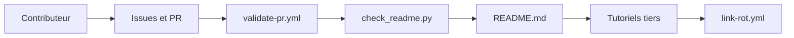

# practical-tutorials/project-based-learning

> Catalogue de tutoriels où l'on construit une application de zéro, classés par langage, pour développeurs débutants.

## Le problème
Apprendre un langage par des exercices isolés lasse vite. Trouver des tutoriels qui aboutissent à un vrai projet, dans le bon langage, demande de fouiller le web.

## Ce que ça fait vraiment
Le README est à la fois le contenu et la présentation : des liens vers des tutoriels externes, rangés par langage (C/C++, Python, Go, Rust, JavaScript…) puis par thème. La section Python couvre scraping, bots, data science, machine learning, OpenCV et deep learning. Le dépôt n'héberge ni code ni application. Un script `check_readme.py` valide le format, et un workflow `link-rot.yml` surveille les liens morts.

## Comment c'est branché

## Essayer
Aucune commande documentée pour l'usage : le README invite à forker le dépôt pour contribuer, et renvoie à CONTRIBUTING.md.

## Coût et pièges
Gratuit. Les tutoriels sont sur des sites tiers : certains sont vidéo, certains marqués « outdated » (Haskell) ou « in progress », et la fraîcheur varie d'un lien à l'autre.

## Ce que ce n'est pas
Pas un cours structuré ni un dépôt de code exécutable : c'est un annuaire de liens. Les tutoriels ne sont ni testés ni notés.

## Alternatives
- Exercism : cité en « Additional Resources », pour des exercices guidés.
- CodeCrafters : cité dans le même bloc, pour reconstruire des outils.
- Hack Club Workshops : cité aussi, ateliers orientés projet.

## Pour toi
À surveiller : les rubriques Python (data science, ML, OpenCV) donnent des projets de démarrage utiles, mais l'annuaire ne remplace pas une veille ciblée data/IA.

