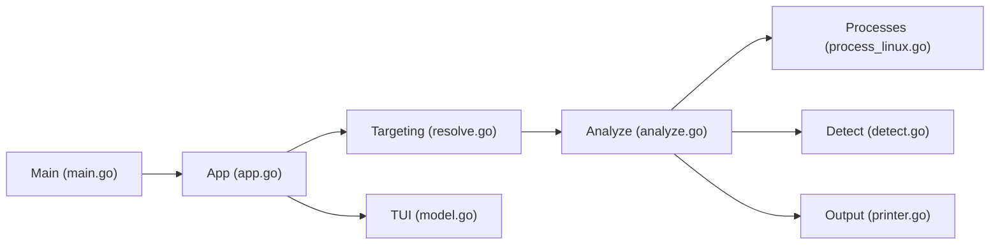

# pranshuparmar/witr

> CLI et TUI qui expliquent pourquoi un processus, port, conteneur ou fichier existe.

## Le problème
`ps`, `lsof`, `ss`, `systemctl`, `docker ps` montrent ce qui tourne, pas pourquoi. Remonter à systemd, pm2, cron ou un conteneur oblige à croiser plusieurs sorties à la main.

## Ce que ça fait vraiment
Ramène toute cible à un PID puis construit la chaîne d'ascendance (ex. `systemd → pm2 → node`).
Désigne une source principale (systemd, launchd, cron, SSH, tmux, conteneur…) et ajoute le contexte : répertoire, dépôt Git, sockets.
Émet des avertissements : root, écoute publique, capacités dangereuses, binaire supprimé, LD_PRELOAD.
Sorties texte, arbre, JSON, codes de sortie pour scripts ; TUI à quatre onglets. Linux, macOS, Windows, FreeBSD.

## Comment c'est branché


## Essayer
```bash
curl -fsSL https://raw.githubusercontent.com/pranshuparmar/witr/main/install.sh | bash
brew install witr
witr node
witr --port 5000 --short
witr --pid 143895 --tree
```

## Coût et pièges
Gratuit, binaire statique. Certaines infos exigent `sudo` ; sous macOS, SIP en masque une partie.

## Ce que ce n'est pas
Pas un outil de monitoring continu ni d'alerte. La détection de source est « best effort ». Projet d'un seul auteur, récent (fin 2025).

## Alternatives
Aucune alternative nommée ; le README cite `ps`, `lsof`, `ss`, `systemctl` comme outils qu'il complète.

## Pour toi
À adopter : sur une machine GPU ou un serveur partagé, savoir en une commande qui a lancé ce process qui occupe le port 8000 ou la VRAM fait gagner du temps.
