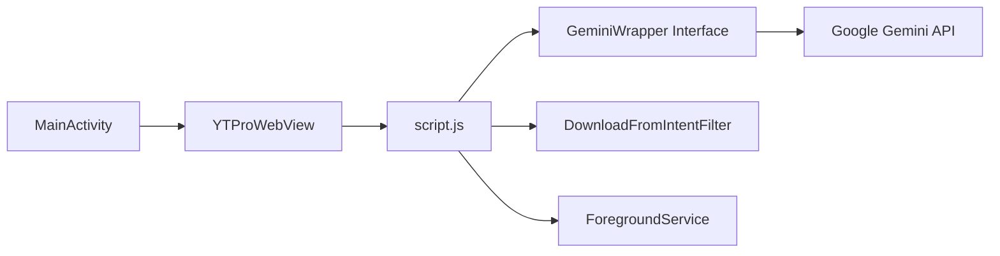

# prateek-chaubey/YTPro

> Client Android de YouTube en WebView avec scripts injectés : téléchargement, bloqueur de pubs, résumé Gemini.

## Le problème
L'application YouTube officielle n'offre ni téléchargement, ni lecture en arrière-plan gratuite, ni résumé par IA.

## Ce que ça fait vraiment
Un APK dont `MainActivity` charge YouTube dans un WebView et y injecte `bgplay.js`, `innertube.js`, `script.js`. Un pont Java expose le téléchargement et `GeminiWrapper` (résumé de vidéo, prompt personnalisable avec `{url}`, `{title}`, `{videoId}`). Un service de premier plan gère l'audio en arrière-plan. Reprend SponsorBlock et return-youtube-dislike.

## Comment c'est branché

## Essayer
Le README ne donne aucune commande ; il renvoie à un téléchargement de l'APK.

## Coût et pièges
Gratuit ; une clé Gemini est nécessaire pour le résumé. Le README présente le projet comme éducatif. Contourner les pubs et télécharger va à l'encontre des conditions d'usage de YouTube.

## Ce que ce n'est pas
Pas un outil data/IA. Dernier push en juillet 2025, soit moins d'un an au jour de la synthèse : pas d'alerte d'ancienneté.

## Alternatives
Aucune alternative nommée dans le README.

## Pour toi
À ignorer : application mobile grand public sans lien avec un travail data/IA, et zone grise vis-à-vis des conditions de YouTube.
