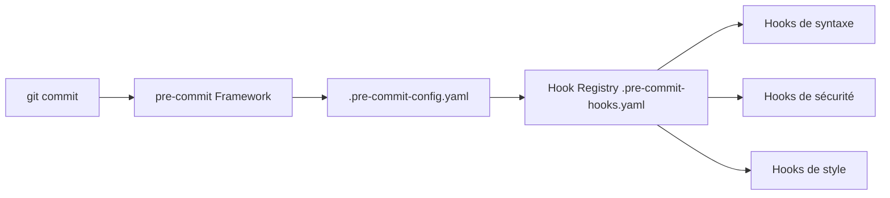

# pre-commit/pre-commit-hooks

> Collection de hooks prêts à l'emploi pour le framework pre-commit : formats, syntaxe, secrets.

## Le problème
Des fichiers volumineux, du YAML invalide, des clés privées ou des conflits de fusion se glissent dans les commits.

## Ce que ça fait vraiment
Une trentaine de hooks : `check-added-large-files`, `check-yaml/json/toml/xml`, `check-ast`, `detect-private-key`, `detect-aws-credentials`, `end-of-file-fixer`, `trailing-whitespace`, `pretty-format-json`, `requirements-txt-fixer`, `no-commit-to-branch`, `check-merge-conflict`. Plusieurs sont configurables par arguments. Aussi installable en paquet autonome.

## Comment c'est branché


## Essayer
```yaml
-   repo: https://github.com/pre-commit/pre-commit-hooks
    rev: v6.0.0
    hooks:
    -   id: trailing-whitespace
```
```bash
pip install pre-commit-hooks
```

## Coût et pièges
Gratuit. Le hook `check-added-large-files` fixe 500 kB par défaut ; `no-commit-to-branch` s'exécute toujours (`always_run`). Plusieurs hooks sont déclarés dépréciés (`check-docstring-first`, `fix-encoding-pragma`).

## Ce que ce n'est pas
Pas un outil de lint Python complet : il faut lui associer ruff, black ou autre. Pas un scanner de secrets exhaustif : seulement clés privées et identifiants AWS.

## Alternatives
Le framework pre-commit lui-même (dépôt pre-commit/pre-commit), pour l'exécution des hooks.

## Pour toi
À adopter : quelques lignes dans un fichier de config bloquent gros fichiers et clés privées avant qu'ils n'atterrissent dans un dépôt de modèles ou de notebooks.

