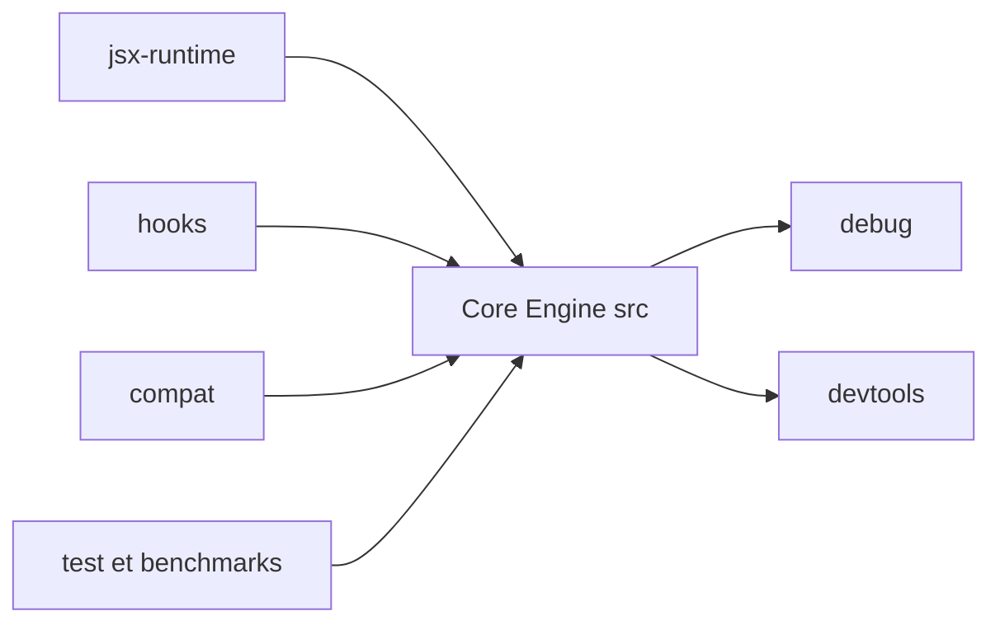

# preactjs/preact

> Bibliothèque JavaScript de composants à DOM virtuel, compatible React, pour les développeurs d'interfaces web légères.

## Le problème
Une interface à composants coûte cher en poids et en temps de rendu quand tout le framework est embarqué. Preact vise la même API que React avec moins de surcharge.

## Ce que ça fait vraiment
Le noyau (`src`) crée les éléments, calcule les différences entre deux arbres et met le DOM à jour sur place. Des modules séparés ajoutent les hooks, un runtime JSX, une couche `compat` pour aliaser React, ainsi que le débogage et les DevTools. Le rendu asynchrone passe par un planificateur remplaçable.

## Comment c'est branché


## Essayer
```bash
# Le README ne documente pas de commande d'installation ; il montre du code :
# import { h, render } from 'preact';
# import { useState } from 'preact/hooks';
```

## Coût et pièges
Gratuit, sans clé. Il faut une chaîne de build JSX (Babel ou `jsxFactory` de tsconfig) : le README le rappelle.

## Ce que ce n'est pas
Ce n'est pas React : la compatibilité passe par l'alias `preact/compat` et n'est décrite que comme « extensive », pas totale. Ce n'est pas non plus un framework complet : routage et état restent à assembler.

## Alternatives
- React : l'API de référence, que Preact imite via `preact/compat`.

## Pour toi
À surveiller : c'est du front web, hors du cœur data/IA/MLOps, mais utile si tu dois livrer une petite interface (tableau de bord, démo de modèle) sans alourdir la page.

