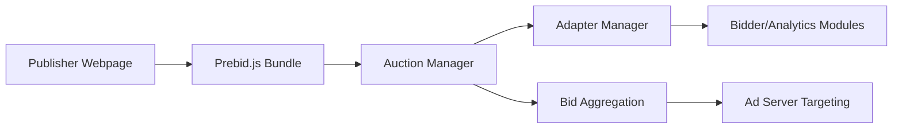

# prebid/Prebid.js

> Bibliothèque JavaScript de « header bidding » pour éditeurs qui vendent leurs espaces publicitaires.

## Le problème
Un éditeur qui veut mettre en concurrence plusieurs régies publicitaires avant l'appel à son serveur d'annonces doit intégrer chacune à la main.

## Ce que ça fait vraiment
Un noyau (gestion d'enchères, adaptateurs, consentement, stockage) et des centaines de modules (adaptateurs d'enchérisseurs, analytics, identifiants) qu'on choisit à la compilation avec `--modules`. Options de build pour retirer vidéo, natif ou journaux. Ce README s'adresse aux contributeurs. Un skill pour agents (DevTools Chrome) est mentionné.

## Comment c'est branché


## Essayer
```bash
git clone https://github.com/prebid/Prebid.js.git
cd Prebid.js
npm ci
gulp serve-and-test --file
gulp build --modules=openxBidAdapter,rubiconBidAdapter,sovrnBidAdapter
```

## Coût et pièges
Gratuit ; Node et `gulp-cli` global. Le README rappelle que la conformité légale reste à la charge de l'éditeur.

## Ce que ce n'est pas
Pas une garantie de conformité (RGPD, etc.). Pas un outil d'analyse de données.

## Alternatives
Aucune alternative nommée dans le README.

## Pour toi
À ignorer : publicité programmatique côté navigateur, hors du périmètre data/IA/MLOps.

